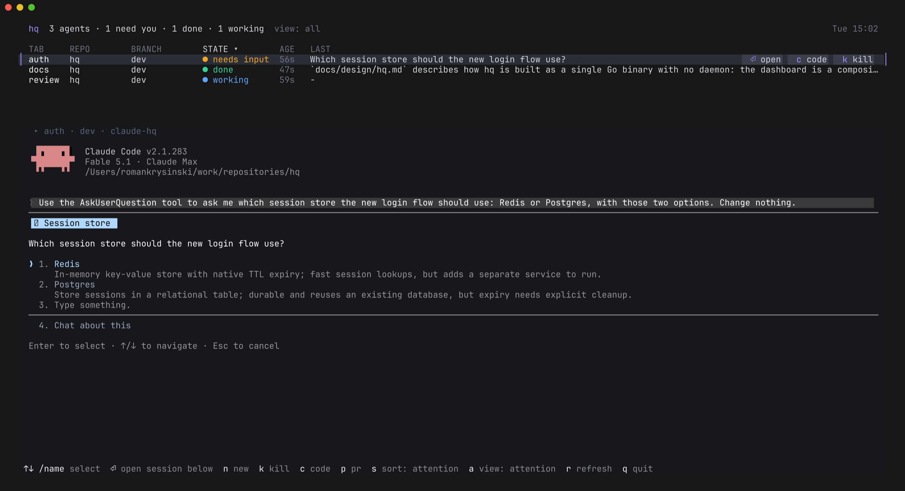

# hq - agents headquarters

hq (headquarters) is one console for many Claude Code agents. Each agent runs in a Docker Sandboxes (`sbx`) microVM and a tmux session; hq shows all of them in one dashboard, sorted by who needs you, and lets you enter, start, stop and inspect any of them from the dashboard or from any shell.



Platforms: macOS (iTerm2) and Windows via WSL (Windows Terminal).

## Install

Prerequisites: git, curl, tmux 3.4 or newer, Docker Sandboxes (`sbx`), VS Code with `code` on PATH; iTerm2 on macOS, Windows Terminal and WSL (Ubuntu 24.04 or newer) on Windows, with Windows Terminal's bell set to flash the taskbar (see [Notifications](#notifications)). Optional: GitHub CLI (`gh`, logged in), only for the dashboard's pull request links (`p pr`); without it hq works the same and shows no pull requests.

```bash
curl -fsSL https://github.com/rkrysinski/hq/releases/latest/download/install.sh | sh
```

This installs `hq` to `~/.local/bin` and checks the prerequisites; no GitHub login is needed. `... | HQ_VERSION=vX.Y.Z sh` installs that release instead of the latest. On macOS with iTerm2 it also adds an iTerm2 profile named `hq` with Option as Esc+, which hq gives only to the tab the dashboard runs in, so the Alt chords work with no setup.

### Setting up sbx

hq starts every sandbox with your `sbx`, so `sbx` has to work on its own first. Once per machine (on Windows from WSL, where the command is `sbx.exe`):

```bash
sbx login                   # without it: error: Not authenticated to Docker
sbx policy init balanced    # before the first sandbox; allow-all, balanced or deny-all
```

When `hq new` cannot create or start a sandbox, `sbx diagnose` says what is missing.

hq creates a repository's sandbox the first time `hq new` runs there, with sbx's default Claude image and no MCP servers. To create sandboxes from a shared image, or with MCP servers you registered with `sbx mcp add`, set them in `~/.config/hq/preferences.json` (`$XDG_CONFIG_HOME/hq` when that is set):

```json
{
  "sandbox": {
    "template": "ghcr.io/<org>/sbx-image:latest",
    "staticMcp": ["pencil"]
  }
}
```

`template` goes to `sbx create --template` and `staticMcp` to `--static-mcp`; either may be left out. `HQ_SBX_TEMPLATE` and `HQ_SBX_STATIC_MCP` (comma-separated) override them for one command. They apply only when hq creates a sandbox: one that exists, hq's or one you created by hand, is used as it is, so to change its image remove it (`hq sandbox rm REPO`) and let the next `hq new` create it again. hq neither pulls nor checks the image; when `sbx` refuses the image or a server, `hq new` shows sbx's error and the settings it used.

### Windows

1. Install `sbx` on Windows, not inside WSL (`winget install Docker.sbx`): hq in WSL runs the Windows `sbx.exe`.
2. Open a new WSL session after installing it. The installer adds `sbx` to the Windows PATH, and a WSL session that was already open does not see it: there hq's installer still reports `sbx: install Docker Sandboxes`.
3. Run the two `sbx` commands above.
4. Check that the machine can run sandboxes: `sbx.exe diagnose` must not report `Virtualization - not available`. `sbx` on Windows is an x86-64 program that needs the Windows Hypervisor Platform feature; it starts no sandbox on ARM64 Windows, nor in a virtual machine without nested virtualization. hq itself runs on those machines (WSL 1 or 2, ARM64 too), so the first sign is a failing `hq new`.

When a newer release is out, hq says so after a command's output (`hq v0.4.0 is available - run hq update`), in the dashboard's header and in `hq --version`; `hq update` moves to it. hq looks at most once a day, in the background, so no command waits for GitHub.

## Everyday use

```bash
hq                               # open the dashboard
hq new NAME [DIR] [PROMPT]       # start an agent for the repository in DIR
hq ls                            # list agents and their state
hq go NAME                       # enter an agent's session
hq send NAME TEXT                # leave a message, delivered when the agent is ready
hq kill NAME                     # end an agent's Claude session; the sandbox stays
```

In the dashboard, agents that need you (a question, a permission prompt) come first; the selected agent's session opens below the list, and the bottom line shows the keys. `hq help` lists every command.

## Notifications

hq sends a desktop notification when an agent needs you or finishes: `Question: <branch>` when its reply ends with a question, `Needs input: <branch>` when it waits on a question dialog or a permission prompt, and `Done: <branch>` when it completes its turn. Each event notifies exactly once, whether or not the agent is the one open in the dashboard. Starting, working and ended agents never notify, and neither does a turn you end yourself (Esc, a refused permission) or a session that has just started. An agent whose turn ends while subagents it started in the background still run is not finished: it stays `working` and notifies once, when the turn Claude takes after the last of them ends. Work a [supervisor](#claude-desktop-as-supervisor) gave an agent does not notify you when it finishes or asks a question: that is for the supervisor, which tells you; a permission prompt or a question dialog still does, and so does any turn you prompted or sent a message into yourself.

Notifications come through the terminal the dashboard runs in, so they appear only while the dashboard is open in a terminal. After `q`, or with the window closed or detached, the agents keep working but nothing is shown, and missed events are not replayed; `hq` brings the dashboard and the notifications back.

- macOS: iTerm2 shows each one as a macOS notification naming the kind and the branch; if none appear, check that notifications are allowed for iTerm2 in System Settings.
- Windows: Windows Terminal flashes its taskbar button; the flash carries no text, and the dashboard shows which agent it was. As installed, Windows Terminal does not flash on a bell, so set it once: in its settings choose "Open JSON file" and give `profiles.defaults` (or the profile WSL runs in) a `bellStyle` that includes `taskbar`:

  ```json
  "profiles": {
      "defaults": { "bellStyle": ["audible", "taskbar"] }
  }
  ```

  `"bellStyle": "taskbar"` flashes without the sound. Without this setting nothing is shown on Windows when an agent needs you.

## Claude Desktop as supervisor

Claude Desktop can start, watch and message your agents through hq's MCP tools (`new`, `list`, `read`, `wait`, `send`, `go`, `kill`). Set it up once, from the shell you run hq in (on Windows, in WSL):

```bash
hq mcp install
```

Then quit and reopen Claude Desktop. This adds an `hq` entry to Claude Desktop's configuration (`~/Library/Application Support/Claude/claude_desktop_config.json` on macOS, on Windows `%APPDATA%\Claude\claude_desktop_config.json`, or the package's own folder under `%LOCALAPPDATA%\Packages\Claude_...` when Claude Desktop came from the Microsoft Store; there Claude Desktop starts hq through `wsl.exe`), keeping your other servers, with a copy of the file as it was next to it. It records hq's path and your `PATH`, so run it again after moving hq or changing where tmux, `sbx` or `gh` live; a second run with nothing changed does nothing. When Claude Desktop is not installed (its folder is not there) or the file cannot be edited safely, it changes nothing and prints the entry to add by hand.

In a conversation, tell Claude what to do ("start 42 in ~/work/app on issue #42, and watch it"). It reads status from hq rather than asking the agents, asks an agent with a message answered when the agent stops, and leaves an agent's permission prompts and questions to you. Work it gave an agent (the prompt it started the agent with, a message it sent) raises no desktop notification when it finishes or asks a question, on any agent: Claude waits for it and tells you, and when it is not waiting you see the agent's state in the dashboard and ask it. What you prompt or send yourself (at the agent, `hq new`, `hq send`) notifies you as ever, and so does a dialog. An agent started by an older hq notifies at every turn end until it is relaunched (`hq sandbox restart`). Claude Desktop asks you before `kill`.

## Uninstall

Delete `~/.local/bin/hq`, the `hq` entry under `mcpServers` in Claude Desktop's configuration if you added it, `~/.config/hq` and, on macOS, `~/Library/Application Support/iTerm2/DynamicProfiles/hq.json`.
