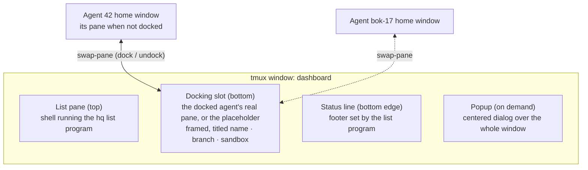
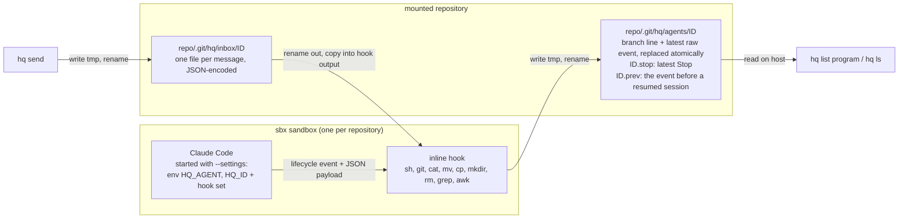
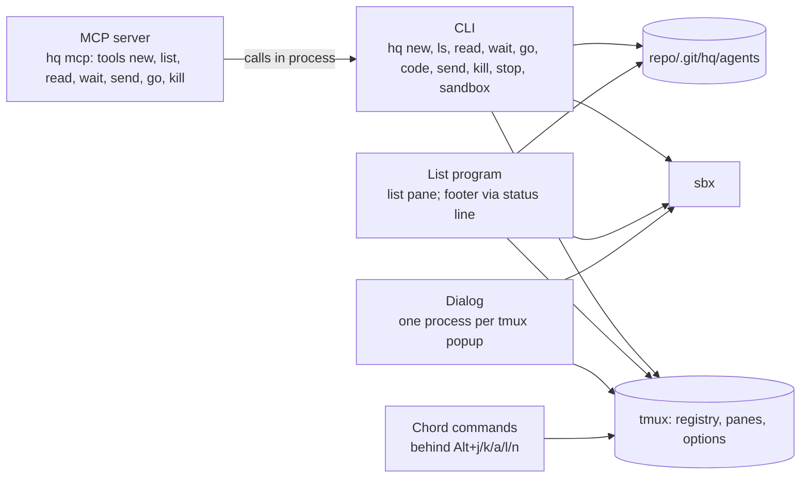
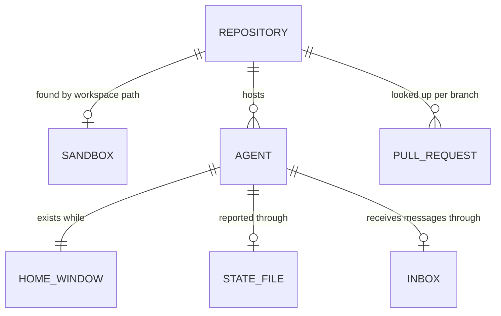

# hq - design

Version 1.0 (draft, in progress)

HOW hq is built. The WHAT is `docs/requirements/spec.md`; this document cites it by section (`§5`), scenario (`S4`) and acceptance (`§10`) and never restates it. Decisions that are hard to reverse live in `docs/adr/`.

## 1. Overview & design drivers

The architecturally significant requirements, in priority order. When two pull in different directions, the higher one wins.

1. **The givens** (§2, ADR 0001). State leaves a sandbox only through the mounted repository; sessions are tmux entities. Non-negotiable.
2. **The docked session is the real session** (§6.1, S3). The agent's own tmux pane is shown and used in the dashboard; nothing is mirrored or previewed. This makes the dashboard a composition of tmux panes rather than a single full-screen program that draws everything.
3. **No daemon** (§8, ADR 0002). Every command works with no dashboard running; only the dashboard observes state and notifies.
4. **Identical behaviour on both platforms** (§2, §8, S13): macOS with iTerm2, and WSL with Windows Terminal, both with plain tmux (ADR 0008). Platform-specific code sits behind one adapter.
5. **Timeliness and exactness** (§5, §10): state visible within 1 s, `ended` within 2 s, exactly one notification per attention event.
6. **Install footprint** (§8, §11): one command per platform, no service.
7. **Phase 2 headroom** (spec, Phase 2): the supervisor drives hq through the CLI's own commands (3.12); a flat row model, sorting and filtering kept separable.

## 2. Constraints & assumptions

Constraints are the spec's givens (§2) and constraints (§8); they are not repeated here. Assumptions below; if one proves false, the decisions that cite it are reopened.

- **A1 - Builders.** hq is built mostly by Claude Code agents working the repository's issues, under the owner's review. Technology is chosen for being agent-friendly and reviewable, not for a team's existing language skills.
- **A2 - Users.** The owner on macOS and a small team (2-6 people) on Windows/WSL. Each person runs their own hq; nothing is shared between machines.
- **A3 - Scale.** Per machine, typically 3-10 concurrent agents, rarely above 15, across 1-5 repositories. At this scale, polling tmux and state files several times a second is negligible, so incremental or event-driven machinery is not justified by load.

## 3. High-level architecture

### 3.1 Dashboard composition

The dashboard is one tmux window built from tmux's own parts ([ADR 0007](../adr/0007-dashboard-is-tmux-composition.md)):



- **List pane.** A shell that runs the list program. The list program owns the list, the cursor, the keys of §6.2-6.5, and the footer text. On `q` it exits and hq takes every client off the `hq` session (3.11), so the terminal gets back what it had before `hq`; the shell stays in the list pane with a hint, seen only by a terminal attached without hq, and `hq` or `hq dash` starts the list there again.
- **Docking slot.** Holds exactly one pane: the docked agent's own pane, or the placeholder with the hint of S1/S6. Docking swaps the agent's pane in from its home window; the pane it replaces goes back to its own home. The agent's process, scrollback and cursor are never interrupted. Every home window is kept at the slot's size (tmux `resize-window`, when an agent's window is made and whenever the layout is applied, and again for the two windows a dock involves, in the same tmux call), so a swap never changes a pane's size and tmux sends the agent no resize: Claude redraws its whole screen on each resize and tmux keeps every cleared screen in the history (#130).
- **The slot follows the cursor.** The list program docks the cursor's row once the cursor has rested for 150 ms after the user's last move (`↑`/`↓`, a click on a row, a search letter); each move restarts the wait, so a held key (repeating every 30-90 ms by default on macOS and Windows) docks only where it stops. These docks leave the keys on the list; `⏎`, a search's `⏎` and a New agent dialog's agent dock with the keys. Only the user's moves dock: a refresh or re-sort moves the cursor with its agent, never to another, and the welcome of a new agent started elsewhere (`hq new`, `hq mcp`; spec S2) takes the cursor and the slot only when nothing is docked. A dock made elsewhere (a chord, `hq go`) moves the cursor to its agent (3.7); the list tells its own docks apart by the refresh that follows, so a refresh collected while its own dock was on the way does not pull the cursor back to the previous row. When the docked agent goes, the cursor takes its row's place without docking it, and the placeholder stays (S6).
- **Placeholder.** Not a shell: a hidden hq command that shows the hint, hides the cursor and takes no commands. Anything it is given (keys, a paste, a click, since it asks tmux for the mouse) is swallowed and puts the keys back on the list pane, so the list's keys keep working. Its pane is marked as hq's placeholder and kept when its program ends, so the home window it waits in never closes with its agent; `hq` starts it afresh when it is not running hq's program, which also replaces the shell an older hq left there, wherever it waits.
- **Frame and title.** The slot is framed on all four sides by the surround (`#16181D`, the design's colour). tmux cannot draw a box with corners inside a window (a border's ends always meet another border as a junction) and colours a border cell by whichever neighbouring pane it finds first from the active one, so the frame is tonal, not a line: two margin panes one column wide either side of the slot (role `spacer`, running the placeholder program with no hint, so a click there puts the keys back on the list) and the status line take the surround; every pane border is drawn in the surround's colour on the surround, so it is invisible whichever pane owns it. Pane statuses sit at the bottom (`pane-border-status bottom`): the list starts on the window's first row (no rule above the header), the border row between list and slot is the list pane's status, which shows the slot's title `▸ name · branch · sandbox` (or `▸ placeholder`) filled in the slot's colour exactly as wide as the slot, so title row and slot read as one area; the slot's own status row below it is the bottom margin. tmux draws a pane's status four columns narrower than the pane up to 3.5 and two from 3.6 on; on 3.6 and later the title's last two columns are given the surround's colour. The docked pane is four columns narrower than the terminal, which is what Claude sees. The terminal is titled `hq - agents`.
- **Where the keys are** (spec §6.1, #128). The side with the keys, the list or the docked session, is on the terminal's own background (tmux's `terminal` colour, not `default`, which in a pane's status row means the border's style; #117), the other on the surround. tmux draws a window's active pane in `window-active-style` and the others in `window-style`, and redraws them whenever the active pane changes, whatever changed it (Alt+l, a click, docking, a dialog's action), so the look follows the keys with no hq process involved. The dashboard window's own styles are the slot's: active the terminal's background, inactive the surround with the default text colour `#9CA3AF`, which dims what the session draws in the terminal's text colour; cells Claude draws in colours of its own keep them. Being the window's, they are taken by whichever agent's pane is docked and stay behind when it goes home: the pane itself carries no style, and its home window has none, so there it looks as tmux's defaults make it. The list pane has its own: active the terminal's background, inactive the surround, its text keeping the list program's colours. The margins are the surround either way, and so is the placeholder, which also has both styles of its own (the surround, text dimmed): it never holds the keys, and a click on it, which gives it the keys for the moment before it hands them back to the list, does not flash it. The title row is drawn from the list pane's `pane-border-format`, which loops over the window's panes (`#{P:}`) to take the slot pane's `pane_active`: the terminal's background and the title in the accent `#A78BFA` while the docked session is the active pane, the surround and the dim `#5C626C` otherwise, the placeholder (role `slot`) always the latter. tmux redraws pane statuses with the borders on every change of the active pane. Every `hq` sets these styles again, so a dashboard styled by an older hq is brought up to date in place, placeholders waiting in home windows included. Esc is not bound: Claude uses it (3.7).
- **Docked row's outline.** The design draws a rounded lavender box around the docked row within the row's own height. A terminal row is one line of cells, so a box needs a line above and a line below the row for its edges. Those lines could only come from the session below (the list's height is fixed, spec §6.1), from the list rows (6 at 24 lines, 3 below), or by pushing the rows apart around the docked one, which the design does not do; and they would move with the docked row as the list scrolls and re-sorts. Cell attributes do not draw it either: an overline takes each cell's text colour, so the top edge would change colour along the row (the state column), and overline and underline colours depend on the terminal and on tmux's terminal features. So the outline is the box's two sides: a lavender `│` in the margin column at each end of the row, reaching the edges the box does, taking no extra line and holding on any background, the cursor's included (#33, #102).
- **Footer.** tmux's status line, content set by the list program (key hints; the `/name` search while typing, `/bo · 1 match: bok-17`, §6.3). Cleared when the list program exits.
- **Dialogs.** tmux popups centered over the whole window, each running an hq dialog (§6.6). The list keeps refreshing underneath; the popup holds all keys and clicks while open.
- **Layout.** The list pane's height is re-applied on every resize: header + 6 rows + footer, 3 rows in a terminal below 24 rows (§6.1, S12); the slot takes the rest. The margins beside the slot are set back to one column each at the same time, since tmux shares a change of width among all panes of a row. The terminal's height is tmux's window height plus the session's status lines, which tmux takes from the terminal, so the classic 80x24 terminal (a 23-line window) shows 6 rows.
- **Agent home windows.** Every agent has a home window in the same tmux session, holding its pane while it is not docked. They are invisible to the user: the footer replaces tmux's window list, and the terminal shows only the dashboard window.
- **Finding the parts.** Like the home windows (3.3), the dashboard window and its panes are found by tmux options hq sets on them: the window is marked as the dashboard, each pane carries its role (list, slot or spacer, the margins beside the slot), and the list program records its process on the list pane while it runs, so `hq` knows whether to start it again. The session's look (colours, margins, titles, a status line that is only the footer) is set on the `hq` session and the dashboard window alone, never on the tmux server's global options, and reapplied on every `hq`.

Satisfies: §6.1, §6.4 (drawn by the list program), §6.6, S1, S3, S6, S8, S12; driver 2.

### 3.2 Platforms

Plain tmux on both platforms ([ADR 0008](../adr/0008-plain-tmux-on-both-platforms.md)). On macOS the dashboard is an ordinary `tmux attach` inside an iTerm2 window; on WSL, the same inside Windows Terminal. The terminal only hosts tmux; everything hq shows is drawn by tmux and the list program, so both platforms share one code path for the dashboard.

**Decision:** tmux 3.4 or newer on both platforms. Notifications come mostly from agents that are not docked, whose panes sit in hidden home windows, and tmux passes their sequences to the terminal only with `allow-passthrough all` (3.4; 3.3 passes only from the visible pane, 3.2a not at all). hq checks the version at install and at start and exits 3 with the remedy (`hq: tmux 3.2a is too old, 3.4 or newer needed (Ubuntu 24.04 ships it)`). WSL baseline: Ubuntu 24.04; macOS gets a current tmux from Homebrew.
**Alternatives considered:** a fallback for older tmux (a bell from the hidden window): a second code path with weaker behaviour, no text, against spec §5 (kind and branch named).

Satisfies: §2, §5 (notifications from hidden panes), §8 (identical behaviour), §11 (prerequisites), S13; driver 4.

### 3.3 Agent registry

**Decision:** tmux is the registry. An agent exists exactly while its home window exists in the `hq` session; what hq knows at launch (name, repository path, sandbox, start time, the `new` marker) is stored on that window as tmux user options, and an `ending` marker while `hq sandbox restart` takes the agent down (sbx lists a stopping sandbox as running for the seconds the stop takes, S9). Every command and the list program read agents from tmux; there is no registry file.
**Rationale:** with no daemon (ADR 0002), the only always-current record of what runs is tmux itself; a separate file would duplicate it and go stale when a window dies outside hq.
**Consequences:** an agent that ended keeps its window, its dead pane kept readable, until it is killed (S7); removing the window frees the name (§4.2). Removing a window ends only the host side of `sbx run`, and Claude keeps running inside the sandbox, so killing an agent first ends its Claude session there (SIGTERM through `sbx exec`, found by the agent id it was launched with), waits a few seconds for it to exit, then removes the window (S6, S10). This holds whatever the pane's state: a pane also dies when only its host-side `sbx run` ends, and Claude then runs on in the sandbox, so an ended agent's session is signalled too, and since there is no pane to watch, the wait asks the sandbox (`pgrep` through `sbx exec`) until the process is gone. Only an agent whose pane died in a sandbox `sbx ls` lists as not running (or not at all) is left alone: nothing runs there, and `sbx exec` would start the sandbox again. The docked agent is known from where the panes are: its own pane, marked with its id, sits in the slot, and the placeholder waits in its home window; the list's other session state (the cursor) is a session option. Both survive `q` and detach as long as tmux runs (S1, S8, S9). An agent's pane carries what must travel with it when docked (its id, staying readable after it ends, passthrough). Staying readable takes two pane options: the dead pane is kept, and the pane has no alternate screen, because Claude draws in the alternate screen and tmux throws that screen away when Claude leaves it, taking the session with it. It also takes hq's session program, a hidden hq command each agent's pane runs `sbx run` through: when a session is cut off (its sandbox stopped, or `sbx run` ended from outside), `sbx run` resets the terminal (`ESC c`) as it exits, and tmux clears the screen, pushing the session into the history, so the dead pane would show only tmux's `Pane is dead` line. Once `sbx run` has ended, the session program draws the pane's latest lines again at the bottom of its screen, each run of blank lines as one, and exits with `sbx run`'s status. The lines come from the last screenful only, the pane's height up to the last line printed: Claude redraws its whole screen on every resize, as on every dock and undock, clearing the screen first (never the history), and tmux pushes each screen it clears into the history (`scroll-on-clear`), so the lines above the last screenful are Claude's earlier screens, each starting with the same banner and conversation, and taken from there they stacked in the dead pane. Those copies stay in the history: `scroll-on-clear` off would keep them out but lose the last screen when `sbx run` resets the terminal, and clearing the history would take with it what only the history holds, the parts of a long conversation that left the screen. Folding the blank runs keeps the conversation in view: Claude pads the rows above its prompt box, and a dead pane made smaller, as docking does, keeps its bottom lines. The line above tmux's `Pane is dead` line is left blank, since tmux marks it as wrapped and a resize would join the last line drawn to it. A screen that shows the latest lines already, as after most `/exit`s, is left as it is; the history keeps everything, the last screen twice and each screen a resize replaced. Removing a docked agent's window first sends its pane home, so the slot gets the placeholder back (S6). Sort and view must survive a tmux restart (§6.2), so they live in a small per-user preferences file. Agent state does not live here; it comes from the hooks (section 3.4).
**Alternatives considered:** a registry file in the user's home (duplicates tmux, goes stale).
**Satisfies:** §4.1 (`ls`, `go`, `kill`, `stop`), §4.2 (name uniqueness and reuse), §6.2 (remembered sort and view), S1, S7, S8, S9; drivers 1, 3.

### 3.4 State channel

Hooks are injected when hq starts Claude and write the agent's state into the repository's `.git` ([ADR 0009](../adr/0009-hooks-injected-at-launch.md)); no repository setup.



- **Identity.** A fresh id per agent, generated at `hq new`, stored on the home window (3.3) and passed to Claude as `HQ_ID`. Stable across `/clear`; never confused with an earlier agent that reused the name.
- **One copy of the script.** The hook script travels once, in the environment `--settings` sets (`HQ_HOOK`), and every hook runs `sh -c 'eval "$HQ_HOOK"' hq-hook KIND [SEQUENCE]`: seven hooks with a copy each made the settings, an argument of the agent's tmux window, longer than tmux accepts for a command (16 KiB).
- **Events used.** Prompt submitted -> `working`; Stop -> `question` or `done`; a dialog opening (PermissionRequest: a question dialog such as AskUserQuestion, or a permission prompt) -> `needs input` at once; the end of that dialog's tool (PostToolUse or PostToolUseFailure) while it is open -> `working`; Notification of kind permission prompt, agent needs input or elicitation dialog -> `needs input` when no dialog is open; session end -> `ended` (also detected from tmux and sbx, section 5); SessionStart -> `done`, without a notification. Until the first event an agent is `starting`. Verified with Claude Code 2.1.283 in sbx (#124): Claude fires SessionStart about 2 s after `sbx run` starts it, before any prompt, with `source` `startup`; with a PROMPT it runs the SessionStart hooks to their end before it fires UserPromptSubmit (a SessionStart hook made to take 3 s delayed UserPromptSubmit by 3 s), so SessionStart is always a session's first report and never overwrites a later one. Without it an agent started without a PROMPT stayed `starting` with its `new` marker until the user's first prompt, while Claude waited at its prompt. `--resume` fires it with `source` `resume` and the same session id; `/clear` fires SessionEnd (`reason` `clear`) and, at once, SessionStart with `source` `clear` and a new session id. hq's SessionStart hooks match `startup|clear` and `resume`: after each Claude waits at its prompt, so the agent is `done`, the last message `-` for a new agent and the latest Stop's otherwise (after `/clear` this also ends the moment of `ended` its SessionEnd gave, and the session id hq resumes at a restart is the new one). A compaction (`compact`), which may come in the middle of a turn, is not matched. A resumed session starts in the repository, not in the worktree its conversation left (verified: its SessionStart and later events carry the repository as `cwd`), so its hook first keeps the state file as `ID.prev`, unless that file is itself a resumed start (restarted again before any prompt), and hq takes the branch, worktree and last message from it until the next report. Verified with Claude Code 2.1.283 in sbx (#71): even with permissions bypassed, AskUserQuestion fires PreToolUse and PermissionRequest as its dialog appears, and answering it fires PostToolUse at once; Claude's own permission-prompt Notification ("Claude needs your permission") follows about 6 s after the dialog appeared and only while it is still open, so the hook drops it when the dialog is already reported. The hook writes a tool's end only when it closes the open dialog (the same tool name), so tools ending while the agent works never rewrite the file and `working` keeps its age, and another agent's tool (a background subagent's) does not close the dialog unless it is the same tool. A permission prompt that is granted returns to `working` when its tool has run.
- **Turns the user ends.** Some turns end at the user's hand with no hook at all: cancelling a dialog with Esc, interrupting a turn at work with Esc, and refusing a permission prompt (Esc or No) fire no PostToolUse, PostToolUseFailure or Stop, and Claude's `idle_prompt` Notification comes 60 s after a Stop, never after these (verified with Claude Code 2.1.283 in sbx, #71, #72). Claude then waits at its prompt. So the collection shared by `hq ls`, the list program and the chords (3.8) also looks at the screen of every agent whose hooks said `working` or `needs input` at least 500 ms ago, all of them in one tmux call per refresh: when Claude waits at its prompt box (a rule, the input line starting with `❯`, a rule, then only the footer, which does not offer `esc to interrupt`) and has printed `● User declined to answer questions` or `⎿  Interrupted` since the user's last prompt, the agent is `done` with `User declined to answer questions` or `Interrupted` as its last message. While a turn is at work Claude's footer offers `esc to interrupt`, so a working agent is never read as ended, whatever its output holds. The moment hq first saw it and the last message are kept on the home window (`@hq_turnend`, keyed by the state file's time it overrules), so `AGE` counts from then in `hq ls` and the list alike, and the agent stays `done` without its screen being read again until the next hook report: the next prompt appears on the screen a moment before its hook reports, and the agent does not flash back to the state the turn end overruled. It sends no notification: no hook runs, and the user is at the agent (spec §5). The lines matched are Claude Code 2.1.283's, recorded as test fixtures; a Claude that draws them otherwise leaves the agent as its hooks said, never a false `done`. The 500 ms keep a screen that lags behind the hooks from overruling them.
- **Rewound turns.** An Esc early in a turn, before Claude has committed anything (about 2-3.5 s into a turn without tools), rewinds it instead: the prompt leaves the transcript and goes back into the input box, and Claude prints no line and runs no hook, so the screen looks like Claude waiting at its prompt after the previous turn (verified with Claude Code 2.1.283 in sbx, #99). No single screen tells this from a turn at work: the footer drops `esc to interrupt` while the user types into the box and in a narrow pane (50 columns), and Claude shows no spinner while its reply streams. What does tell is that a turn at work keeps changing its screen (the spinner redraws several times a second, the reply grows; in the samples taken, a working agent's screen never stayed the same for more than about half a second), while a rewound one stays still. So a `working` agent's screen is at rest when it shows the prompt box at the bottom, a footer without `esc to interrupt`, no spinner line (a glyph and a word ending in `…`, as `✶ Brewing…`) since the last prompt, and in the box nothing or the prompt the hooks reported (`UserPromptSubmit`'s `prompt`, whitespace aside), which is what the rewind puts back; text the user typed during the turn, or a `/` menu that hides the turn, is neither. The first look that sees it at rest stores the moment and a fingerprint of the screen in the home window's `@hq_restseen`, keyed like `@hq_turnend` by the report; a later look, from any process, that sees the same screen at rest 2 s or more after it makes the agent `done` with `Interrupted`, since that first moment, and records it in `@hq_turnend` like the turns above. A screen that changed in between starts over. The list looks every 250 ms, so it shows the end within about 2 s; `hq ls`, which looks once, looks again after 2 s when an agent's screen is at rest with its prompt back in the box, so a single `hq ls` shows it too (with an empty box, as after the user cleared it or while a narrow pane streams, it does not wait, and the next look decides). A rewind right after a turn the user ended leaves that turn's `Interrupted` or declined line above the box, which alone would read as this turn's end; so when the box holds the reported prompt and the last prompt shown sent above it is another, the line is taken for the earlier turn's and the rule above decides (an interrupt that puts its prompt back in the box leaves it sent above too; with the box emptied the two cannot be told apart, and the agent shows `done` at once, with the earlier line's message).
- **The first record wins.** Several hq processes look at the same agents at once (the list refreshing, `hq ls` in a script, a chord), and each may be the first to see a moment the hooks do not date: a turn the user ended (`@hq_turnend`), a screen first at rest (`@hq_restseen`), an end nothing dated (`@hq_endseen`). A process that read the window options, found no record and then wrote its own would overwrite the record another process stored in between, and `AGE` would jump back (#100). So a record is stored only if the option does not already hold one of the same thing (the same report, the same look, the same start), in one tmux call that both checks and sets (`if-shell -F` on `#{m:KEY*,#{@hq_...}}`, then `set-option`) and prints what the option holds after it (`display-message -p`); the tmux server runs the whole call before another client's (an integration test races eight writers), so of racing processes the first wins, and each shows the moment the stored record says, its own or the winner's.
- **Entered after a moment (`hq wait`).** `hq wait` returns an agent that entered `done`, `question`, `needs input` or `ended` after its `--since` (spec §4.1), and its processes, one call after another and beside the list and `hq ls`, must agree on whether that happened before or after a moment, with nothing watching between two calls. So each compares a moment derived only from what every process reads, the state file and the window records: the moment from which any look could see the agent in its state (`Agent.Entered`). It is the moment `AGE` counts from except where that is dated before the state can be seen. A state the hooks report: the state file's time. A turn the user ended with a line on the screen: the `@hq_turnend` record's moment, when hq first saw it. A rewind: that record holds the moment its screen was first seen at rest, which `AGE` counts from, but the turn is decided 2 s later, so the moment plus 2 s; a rewind is told from an `Interrupted` line by the `@hq_restseen` record of the same report carrying the same moment. `ended`: the earliest of the session-end report, the first-seen end (`@hq_endseen`) and the pane's death plus 1 s, since tmux dates a death to the whole second. A look beginning at N returns the waited-on agents whose moment is after `--since` and no later than N - 250 ms, and prints N - 250 ms (never before `--since`) as the next call's `--since`. The 250 ms are for what a look may not see yet although it is dated: a state file's time is set as the hook writes its temporary file, a moment before the rename puts it in place, and a record's moment is taken just before the screen is captured and the record stored. What entered later falls into the next window; consecutive calls' windows meet without overlap, so a change between two calls is returned once, by the next call. Without `--since` the window starts after the call's first look, so an agent already in such a state is not returned, including one whose turn end or end that look is the first to see. `hq ls --json` and `hq read --json` print, as `next_since`, the same N - 250 ms for a look beginning at N, and `hq send --json` the moment 250 ms before it leaves the message: a `hq wait` from there returns every change the result could not have shown, such as the reply to the message, however late it is called; the price is that a state entered in those 250 ms may be returned once although the result showed it. An agent waited on that the last look saw and this one does not (killed; a kill usually shows `ended` first, from the session-end report SIGTERM makes Claude write) is returned as `ended` at once, since no later look can see it. Costs: a reported state is returned 250-500 ms after its time, an end dated only by the pane's death up to 1.5 s after it (as `ended` in 5.1, within §10's 2 s); a state file rewritten without a change of state counts as entering it again.
- **Branch.** Hooks run in Claude's current directory, which moves into the worktree Claude creates (`CLAUDE_PROJECT_DIR` stays at the repository). The hook asks git there for the checked-out branch and writes it as a header line (`branch NAME`) before the payload: git answers inside the sandbox, where the path is valid on both platforms, so the host never maps sandbox paths to find a branch. Empty before the first event and on a detached HEAD. The payload's `cwd` is kept as the worktree path (for `hq code`, M4).
- **Interpretation on the host.** The hook stores the raw payload after the branch line; hq derives the state, the time it was entered, the one-line last message and takes the branch. `question` vs `done`: the last assistant message ends with `?`, the rule proven by `notify.sh` in support-chatbot.
- **Last message.** `last_assistant_message` of Stop; while `needs input`, what the dialog asks (the first question of AskUserQuestion; for a permission prompt the tool and its description or command), or the Notification's own message when it came without a dialog. The hook also keeps the latest Stop payload as `ID.stop`, so a `working` or `ended` agent still shows its previous reply. An `ended` agent's `AGE` counts from when its session ended, never from its last report or its start: the session-end report's time when there is one (`/exit`); otherwise when its pane died, which tmux keeps for a dead pane (`#{pane_dead_time}`, whole seconds; a killed or crashed Claude, a launch that failed); otherwise when hq first saw it `ended` (a sandbox stopped while the pane lives on, a restart's `ending` marker, or a tmux too old to date a dead pane), which the first `hq ls` or list refresh to see it stores in the window's `@hq_endseen` together with the start time and the last report it belongs to, so every later look, from any process, shows the same `AGE`, and a relaunch or a report after it starts over: a record from before the agent's last report is not its end (#104). Ended rows are then ordered newest end first (spec §6.2).
- **Messages (`hq send`, [ADR 0012](../adr/0012-hq-send-messages-cross-into-the-sandbox.md)).** The host leaves each message as one file in the agent's inbox, `.git/hq/inbox/ID`, named by the time it was sent in nanoseconds (zero-padded, so names sort in the order sent), a random part, and `.now` for `--now`; written as a dot file and renamed into place, it holds the text already encoded as the inside of a JSON string (after the escapes and control characters but newlines and tabs are stripped; at most 8 KiB), so the hook copies bytes and needs no encoder. Whoever renames a message out of the inbox first delivers it, the hook into a directory of its own (`.taken.PID`) or `hq send` (`.taken-*`), so each is delivered once without a lock (an integration test races both). The hook delivers everything waiting, oldest first, each prefixed `Message from the user (hq send): ` and separated by a blank line: on Stop as `{"decision":"block","reason":...}`, so Claude goes on and stops again (with `stop_hook_active`, and blocked again only if another message came in meanwhile); the blocked Stop writes no report and prints no notification, so the agent stays `working` and the stop after it notifies once. On UserPromptSubmit as `additionalContext`, riding along with the prompt. On PostToolUse only when one of the messages has `.now`, as `additionalContext` with the tool's result; not on a subagent's tool (its payload carries `agent_id`, and Claude hands that result to the subagent), nor on PostToolUseFailure. While a dialog is open no Stop or tool end of it comes, so a message waits for its end. For an agent that waits at its prompt (`done`, `question`), `hq send` reads its screen as for rewound turns: with the prompt box at rest and empty it takes the messages out of the inbox and types them in as one bracketed paste through a tmux buffer of the pane's own (`set-buffer` in parts of 4 KiB, `paste-buffer -p -d`), then Enter 300 ms later, so their lines stay one prompt and no key in them acts; with anything in the box, or no box, it leaves them for the next prompt's hook. It reads the screen with its styles (`capture-pane -e`), because Claude draws hints in the empty box faint: a session that has just started shows a placeholder there (`Try "create a util logging.py that..."`, seen with Claude Code 2.1.283 in QA, recorded as a fixture), which read as text would keep a new agent from ever getting a message typed in; faint text on the input line is not counted, while what the user types never is faint. A `starting` agent is waited for up to 30 s, then left to its hooks. Verified with Claude Code 2.1.283 in sbx (#135): a blocked Stop continues the turn, and Claude shows the reason in the session as `Stop hook error: <reason>` (recorded as a screen fixture); both `additionalContext`s reach Claude; a multi-line bracketed paste and Enter submit one prompt; a background subagent's PostToolUse carries `agent_id`. Agents started before this have hooks that ignore the inbox, so hq marks those that deliver (`@hq_inbox`, set at `hq new` and at a relaunch) and `hq send` refuses the others with the remedy.
- **No task list (rejected, #133).** `hq read` was to show the tasks Claude tracks for itself. Claude Code 2.1.283 offers its task tools (TaskCreate, TaskUpdate) only to older models by default (Opus 4.7 and before, Sonnet 4, Haiku 4.5), so the agents' model keeps no task list, and turning them on (`CLAUDE_CODE_ENABLE_TODO_TOOLS`) would change Claude's defaults, which hq does not do. So hq neither enables the tools nor reads a list.
- **Location.** The main repository's `.git/hq/`, found from any of Claude's worktrees through git's common directory. Never tracked, no ignore rule.
- **Lifetime.** An agent's files live as long as the agent: when hq removes it (`hq kill`, `hq stop`, the Kill dialog, `k` on an ended row), it deletes that agent's `ID`, `ID.stop`, `ID.prev` and its inbox with any message still waiting after its window, when its session has ended and nothing reads them any more. Only the removed agent's files go, by id: agents of other tmux servers (another worktree's `scripts/local-dev.sh`, a tester) report to the same directory, and hq cannot tell whether an unknown id is gone or lives elsewhere, so it never prunes other files. A killed Claude writes its session-end report on SIGTERM, so the files go only after its process is gone, whether its pane lived or not. A session that outlives the kill's wait may write its file once more; that file stays.

Satisfies: §4.1 (`hq wait`, `hq send`), §5 (states, age, last message, no setup), §5.1 (messages), §8 (no repository files), S2, S4, S5, S11; drivers 1, 3.

### 3.5 Notifications

The agent's injected hook sends the notification ([ADR 0010](../adr/0010-hooks-send-notifications.md)): on Stop it returns `Question: <branch>` or `Done: <branch>` (the `?` rule in `awk`), on a dialog opening and on a Notification that comes with no dialog open `Needs input: <branch>`, as a `terminalSequence` that Claude writes to its pane and tmux passes to the terminal. hq bakes the platform's notification sequence into the hook at launch (3.10), and every agent window gets `allow-passthrough all` when it is made (3.2; it is a pane option, so it is set per window rather than on the session). tmux drops a bare OSC 9, and Claude accepts from a hook only OSC and BEL, not tmux's passthrough wrapper; Claude wraps the sequence itself when `TMUX` is set, which sbx does not pass into the sandbox, so the injected settings set it (verified with Claude 2.1.283). The branch is the one the hook reads for the state file, or the directory's name when HEAD is detached; it loses control characters, `\` and `"` so it cannot break the JSON or add a sequence of its own, and neither it nor the message is ever used as a format. Only Stop, a dialog opening and the attention Notifications carry the sequence; the prompt, tool-end and session-end hooks print none (the prompt and tool-end hooks print only messages, 3.4), a Stop blocked to deliver messages prints none either, and the Notification Claude sends seconds after a dialog it already reported is dropped, so a dialog notifies once. A turn the user ends with Esc runs no hook and notifies nothing (3.4). No hq process takes part, so exactly-once holds by construction. tmux passes the sequence only to a terminal attached to the `hq` session, and `q` detaches it (3.11), so after `q` notifications stop until `hq` (ADR 0007, 0010).

Satisfies: §5 (exactly one notification per attention or done event, docked or not, kind and branch), §10, S4, S5; drivers 3, 5.

### 3.6 Sandboxes

**Decision:** hq resolves DIR to the main repository root (through git, so a subdirectory or one of Claude's worktrees is the same repository) and finds that repository's sandbox by workspace path in `sbx ls --json`, not by name. With none, the first `hq new` creates it under sbx's default name; the one-time Claude login happens in the docked session (S2). An agent's home window runs `sbx run --name <sandbox> -- --settings '<env + hooks>' [prompt]`, through hq's session program (3.3).
**Rationale:** lookup by workspace path cannot collide on two repositories with the same folder name and adopts sandboxes the user created by hand.
**Satisfies:** §2 (one sandbox per repository), §4.1 (`hq new`, `hq sandbox`), S2, S11.

- **`hq sandbox restart REPO`** (S9): after confirmation (`-y` skips it, no terminal refuses, as `hq kill`), stop and start the sandbox, then relaunch each of the repository's agents in its own pane (`respawn-pane`, through hq's session program, 3.3), same window, same name, same id, with `--resume <last Claude session id>` taken from the agent's last state file, so each conversation continues. The window is never removed, so the row stays through the restart (`ended` from the `ending` marker, then `starting`), the name stays taken, and a docked agent, whose pane is in the slot, stays docked with its frame. The window's start time moves to the relaunch, set only after the pane is respawned and the `ending` marker is gone, so no refresh sees the new session ended (and dates that end) as it starts (#104); the state file, kept, is the previous session's until the new one reports: a report older than the start gives the branch, worktree and last message, not the state (5.1), so the row reads `starting` with what it last said, until the resumed session reports its start (SessionStart, 3.4) and the row is `done` with the same branch, worktree and last message, kept through `ID.prev`. Start times are kept to the millisecond so a relaunch in the same second as the last report is told apart. After `sbx stop` hq waits for the agents' panes to die (at most the kill's wait), so no hook of the old session writes after the relaunch. sbx has no start command: running anything in a stopped sandbox (`sbx exec`) starts it, which also restarts a sandbox without agents. The session id is read before the stop and passed only when it has the form of a Claude session id, since the sandbox writes the state file; an agent that never reported, or whose session never had a prompt (its latest report a SessionStart of a new session), starts fresh: Claude keeps no conversation for such a session, and `--resume` with its id fails with `No conversation found` (verified with Claude Code 2.1.283 in sbx, #124; after `/clear` it does keep one). An agent killed while the sandbox restarts is not relaunched.
- **`hq sandbox rm REPO`**: refused while agents of the repository run (§4.1), then hq asks and runs `sbx rm --force` (sbx would otherwise ask a second time). REPO is a directory in the repository, its name as `hq ls` shows it, matched against the base name of each sandbox's workspace, or the sandbox's own name as `sbx ls` shows it (#113), which also tells apart two repositories of the same name.

### 3.7 Keys and mouse

**Decision:** prefix-free Alt+letter chords, bound in tmux for the `hq` session only, work anywhere in the dashboard, including while typing to Claude in the docked session:

| Chord | Action | Mirrors in the list |
|---|---|---|
| `Alt+j` / `Alt+k` | dock next / previous row | `j` / `k` |
| `Alt+a` | dock the first agent needing attention, skipping the one docked now | view `a` |
| `Alt+l` | toggle focus between list and session | - |
| `Alt+n` | New agent dialog | `n` |

Docking by chord moves the cursor to the newly docked row. Esc is deliberately no focus key: Claude uses it to interrupt, cancel dialogs and rewind (Esc Esc), so it reaches Claude unchanged; `Alt+l` and clicks move the keys (#128). Each chord runs an internal hq command that performs the swap, so it works whatever the list program is doing. Kill stays `k`, `y` (`Enter` means No, ADR 0004).
**Rationale:** walked through the triage, kill, new-agent and name-jump flows: the triage loop is one chord per hop without leaving the keyboard. Alt+Enter (Claude Code's newline), Alt+arrows (word movement in Claude's input; Windows Terminal's pane focus) and Alt+Space (Windows system menu) collide; home-row letters mirroring the list keys do not. Skipping the docked agent in `Alt+a` avoids re-docking an agent whose answer has not yet been reported (up to one refresh tick).
**Alternatives considered:** Alt+arrows and Alt+Enter (collisions above); the tmux prefix (two keystrokes, and tmux's default prefix Ctrl+B is a Claude Code key); function keys (off the home row, need Fn on Mac laptops).
**Satisfies:** §6.3, §6.5 (in-session dock previous/next/first needing attention, focus switching), S3, S4; drivers 2, 4.

- **Option as Alt on macOS.** iTerm2 sends Option as a special character by default; hq's installation adds an iTerm2 dynamic profile with Option as Esc+, and hq switches the dashboard's tab to that profile when it attaches (3.11). No user setup (spec §5, §11).
- **Mouse.** tmux mouse mode on for the `hq` session only. Clicks in the list go to the list program (row: cursor; strip item: action, §6.3, §6.4); clicks in the docked pane focus it and pass to Claude; an open popup takes all clicks (§6.6). Inside `hq` a drag selects through tmux (copy mode); the terminal's own selection stays one modifier away (Option-drag in iTerm2, Shift-drag in Windows Terminal), and other tmux sessions keep the server's setting.

### 3.8 Components of the hq binary

One binary, five roles; they share the row model and never talk to each other directly: tmux and the state files are the only shared state.



- **List program.** Bubble Tea and Lip Gloss: header, rows, action strip, scroll hint (§6.1-6.4), mouse from tmux, colours degrading on terminals with fewer colours. Sets the footer through the `hq` session's status line and clears it on exit.
- **Dialog.** A short-lived hq process in a tmux popup, same library, styled as the mocks (§6.6). It performs its own action (kill, start); the list sees the result on its next tick. It stays open to show an error under a field (duplicate name). `Alt+n` opens the same New agent dialog anywhere. The popup runs a hidden hq command; tmux draws its frame and holds the client's keys, and the list, which opened it, refreshes on while it waits for it to close.
- **Row model.** One model for `hq ls` (plain columns, `--json`), `hq wait` (the rows it returns, as `hq ls` gives them) and the list program (§4.1, §6.1). `hq read` shows the same row, pending messages included, with the agent's detail, read from its state files: the last Stop's reply with its lines kept (stripped as in 7.3), and what the open dialog asks in full.
- **MCP server.** `hq mcp`, started by Claude Desktop over its standard input and output; each tool calls the CLI command of the same name inside the process, with its output as the tool's result (3.12).
- **Platform adapter.** Every role reaches `sbx`, the editor, the browser, the notification sequence and Claude Desktop's configuration through it (3.10); nothing else knows the platform.

Satisfies: §4.1, §6.1-6.6, S2, S6, Phase 2; drivers 2, 3, 7.

### 3.9 Distribution and updates

**Decision:** on every `v*` tag the release workflow cross-compiles hq (macOS arm64/amd64, Linux amd64/arm64) and attaches the binaries to the GitHub release, beside the notes written by `scripts/release.sh`. The repository is public, so everything reads the release's public URLs over HTTPS with no login and no `gh`. First install is one command: `curl -fsSL https://github.com/rkrysinski/hq/releases/latest/download/install.sh | sh`; `install.sh` puts the binary in `~/.local/bin/hq` and, on macOS, the iTerm2 profile of 3.7. `hq update` does the same from inside hq with Go's HTTP client: latest release, download, verify, replace itself in one step. hq looks for a newer release at most once a day and never makes a command wait for the answer (spec §4.2): the answer is cached in the per-user preferences file, and every command reads only the cache. A user command that finds the check due starts it in a detached hq and exits; the dashboard's list checks in its own background. After its output, a user command in a terminal adds the update notice on stderr when the cache holds a newer release; the dashboard's header and `hq --version` show the hint.
**Rationale:** one command on both platforms with no tooling beyond `curl` and no login; `gh` stays what it is for the user anyway, the pull request lookup (5.2), and is optional. A command that asked GitHub itself would be as slow as GitHub, or fail with it; a detached check costs a command one process start a day. No daemon (ADR 0002).
**Alternatives considered:** `gh release download` (a login and `gh` for every user, needed only while the repository was private; the first implementation); the GitHub API for the latest tag (`api.github.com/repos/.../releases/latest`: a second base URL, and 60 unauthenticated requests an hour per address, shared behind a company's NAT); asking GitHub inline with a short timeout (still a wait on every due command, and offline a failure to hide); the next command reading what a previous one fetched in-process (a command would still wait on it); a Homebrew tap (poor on WSL); `go install` (every machine needs the Go toolchain).
**Satisfies:** §4.1 (`hq update`, `--version`), §4.2 (update notice, no command waits on GitHub), §6.1 (update hint), §8 (one-command install), §11; drivers 3, 6.

- A release holds `hq-<os>-<arch>` for each platform, `install.sh` and `SHA256SUMS`, at `https://github.com/rkrysinski/hq/releases/download/<tag>/<file>`. The latest release's tag is where `.../releases/latest` redirects (`.../releases/tag/<tag>`; a repository without releases redirects to its releases page, a private or missing one answers 404). `install.sh` (with `curl`) and `hq update` read that tag first and then download both files from that release, so the binary and its checksums always come from the same release, even while another is published. `HQ_VERSION=vX.Y.Z` makes `install.sh` take that release instead. `HQ_RELEASES_URL` replaces the base URL for both `install.sh` and hq, for tests and QA against a stub server that answers the same way.
- Requests time out: 15 s for the latest tag, 5 minutes for a download. `hq update` replaces its own executable by writing the new binary next to it and renaming it over it, so hq is never half-written.
- The per-user preferences file is `$XDG_CONFIG_HOME/hq/preferences.json` (default `~/.config`) on both platforms. Several hq processes change it at once (the list's sort and view, the update check, `hq update`), so every change reads, changes and writes it under an `flock` on `preferences.json.lock` (let go when the process ends, however it ends), and every write goes to a temporary file renamed over the file, so a reader never sees half a file.
- The daily check: a command reads `update_checked` from the file without the lock; when it is a day old (or later than now, the clock set back), it takes the check under the lock by storing the current time, so of the hq processes that find it due at once only one checks, and a failed check waits a day like a successful one. It then starts `hq __update-check` detached: its own session (`setsid`), no terminal, stdin, stdout and stderr on `/dev/null`, never waited for; that process asks for the latest tag and stores it as `latest_release`, silently, whatever happens. The list program does the same without the extra process, in its hourly look at the cache. Only the user's own commands start a check (not `hq mcp`, `hq update`, the dashboard's hidden commands or a mistyped one); `hq ls --json` and the like start it, but print no notice.
- The notice is `hq vX.Y.Z is available - run hq update` on stderr, printed after the command's output and error, only when stderr is a terminal and the cached release is newer than this hq; never with `--json`, in `hq mcp`, `hq update`, `hq --version`, the dashboard (`hq`, `hq dash`) or the hidden commands. A development build (version `dev`) neither checks nor tells, and `hq update` moves it to the latest release.
- `install.sh` checks the prerequisites (`git`, `curl`, `tmux` with the minimum version, `sbx`, `code`) and hq checks tmux, and they fail with exit code 3 and the remedy (§4.2). `gh` is not one of them: without it, or logged out, only the pull request lookup (5.2) finds nothing.

### 3.10 Platform adapter

**Decision:** one component is the only code that knows the platform. hq detects it at startup, not at build time: the Linux binary is on WSL when `WSL_DISTRO_NAME` is set or `/proc/sys/kernel/osrelease` names Microsoft. The adapter covers exactly seven concerns:

| Concern | macOS | WSL |
|---|---|---|
| sbx command | `sbx` | `sbx.exe` through Windows interop |
| Paths between hq and sbx | unchanged | `wslpath -w` towards sbx, `wslpath -u` back (workspace lookup in 3.6, worktree path for `c`) |
| Editor (`c`, `hq code`) | `code PATH` | `code PATH`; the Remote-WSL shim takes Linux paths. hq collects the shim's stderr in a file, never a pipe: on WSL 1 a Windows program cannot open a pipe as its stderr, and the shim then opens nothing and still exits 0 (#7) |
| Browser (`p`) | `gh pr view --web` | the same, with `BROWSER` set to `wslview` or `explorer.exe` when unset |
| Notification sequence baked into the hook (3.5) | OSC 9 (`ESC ] 9 ; text BEL`) | BEL, shown as a taskbar flash; it carries no text. Windows Terminal flashes only with `bellStyle` including `taskbar` in its settings, which it does not have as installed; the user sets it (README, spec §11), hq never edits Windows Terminal's settings |
| Raise the window titled `hq - agents` (3.11) | `osascript` to iTerm2, selecting the session on the attached client's terminal | `powershell.exe`: find the window by its title, ask Windows to bring it to the front, then look at which window is in front. Windows lets only the process with the last input do that and answers "done" to any other while only flashing the taskbar button (the foreground lock, #9), so when another window is still in front the script taps Alt, which makes it the process with the last input, and asks again; if the other window stays in front it fails and `hq go` says so |
| Claude Desktop's configuration and how it starts hq (3.12) | `~/Library/Application Support/Claude/claude_desktop_config.json` (`~/.config/Claude/...` on a plain Linux); command: hq's path, `mcp`, the environment in `env` | the Windows user's `%APPDATA%\Claude\claude_desktop_config.json`, found with `cmd.exe /d /c echo %APPDATA%` and `wslpath -u`; command: `wsl.exe -d DISTRO --exec /usr/bin/env K=V... HQ mcp` |

Everything else (tmux, registry, state files, keys, dialogs) is one code path.
Paths cross at the sbx client's boundary: the workspaces sbx reports come back as hq's paths, and the workspace hq gives goes out as sbx's path, so the rest of hq only ever sees its own paths. One set of contract tests (an sbx command; every path survives the trip to sbx and back) runs against both adapters and the test fake, which gives sbx Windows-like paths so a test shows which paths went through the adapter.
**Rationale:** these are the only points where the platforms really differ; a narrow interface keeps the rest free of platform branches and lets both sides share one set of contract tests with a fake.
**Alternatives considered:** build-time selection (a WSL binary and a plain Linux binary would differ for no reason); platform checks at each call site (scattered, against spec §8).
**Satisfies:** §2, §4.1 (`hq code`, `hq mcp install`), §6.4 (`c`, `p`), §8 (identical behaviour, platform code isolated), §11, S13; driver 4.

### 3.11 Opening and raising the dashboard

**Decision:** hq never opens terminal windows; it uses the terminal it is run in.
- `hq` / `hq dash` first docks the cursor row when nothing is docked (S1), from what the list would show: the cursor's agent (the `@hq_cursor` session option) when the view shows it, else the first row, the keys staying on the list as with the cursor's own docks (3.1). It is done by the command, not the list program, since coming back to a running dashboard starts no list program. Outside tmux it attaches there with `attach -d`, detaching any other client, so there is one dashboard at a time. Inside the `hq` session it selects the dashboard window; inside another tmux session it switches the client rather than nesting.
- On iTerm2, just before attaching, hq sends iTerm2's `SetProfile=hq` sequence, so that tab alone takes the installed profile with Option as Esc+ (3.7). Windows Terminal needs nothing.
- `q` (S8) takes the terminal off the `hq` session once the list program has ended: a client whose last session is another session of the same server is switched back there and shown the S8 hint on its status line; any other client is detached, so tmux restores the terminal (normal screen, full scroll region, mouse off) and `hq` returns, printing the S8 hint. The list pane is left without a list program, so the next `hq` starts it and attaches to the same layout and docked session.
- While attached, tmux sets the terminal's title to `hq - agents` (`set-titles`, the `hq` session only). `hq go NAME` from another shell docks the agent; if a dashboard client is attached it asks the platform adapter to raise the window titled `hq - agents` (3.10); if none is, it attaches in the current terminal as `hq` does. With no terminal to attach in (standard input not a terminal, as under `hq mcp`) it only docks the agent and says to run `hq` in a terminal: it never attaches tmux to a pipe, and never opens a window.

**Rationale:** attaching in place avoids driving terminal windows, which differs per terminal; what remains is one narrow action, "raise the window titled hq - agents", with the same shape on both platforms.
**Alternatives considered:** opening a new terminal window per `hq` (iTerm2 AppleScript and `wt.exe` differ in every detail, and the user loses the terminal they chose); several attached dashboards (tmux clients fight over the window size).
**Satisfies:** §4.1 (`hq`, `hq dash`, `hq go`), §4.2 (same from any shell), §6.5 (Alt chords need Option as Esc+), S1, S8, S9; drivers 2, 4.

### 3.12 MCP server for Claude Desktop

**Decision:** `hq mcp` is an MCP server over standard input and output, in the hq binary itself, built on the official Go SDK (`github.com/modelcontextprotocol/go-sdk`, v1.8.0). Claude Desktop starts it as a child process and ends it; it opens no port and leaves nothing running (ADR 0002), and `hq update` keeps it in step with the CLI. Each tool is a thin layer over the CLI command of the same name, called inside the process with an empty standard input, its standard output and error as the tool's text and a failure as an error result ("hq: ..." as on stderr):

| Tool | Command | Annotation |
|---|---|---|
| `new(name, dir, prompt?)` | `hq new NAME DIR [PROMPT]`; DIR must be absolute (or `~/...`) and exist, since the server's working directory means nothing | not destructive |
| `list()` | `hq ls --json` (`{agents, next_since}`) | read-only |
| `read(name)` | `hq read NAME --json` (with `next_since`) | read-only |
| `wait(names?, since, timeout?)` | `hq wait NAMES --json --timeout T --since S`, T at most 50 s; `since` required | read-only |
| `send(name, text, now?)` | `hq send NAME TEXT [--now] --json` (`{delivery, next_since}`) | not destructive |
| `go(name)` | `hq go NAME` (3.11: docks; raises the dashboard when a client is attached, else says to run `hq`) | not destructive, idempotent |
| `kill(name)` | `hq kill NAME -y` | destructive, so the client asks the user first |

`hq stop` and `hq sandbox` are not offered (PRD #132). The server's instructions and each tool's description teach the protocol of spec Phase 2: status from `list` and `read`, never by asking an agent; ask with `send` and `read` the answer at the stop; watch with `wait` in a loop; never answer an agent's dialog, tell the user. **`since` is the moment of the last result.** Every `list`, `read`, `send` and `wait` result carries `next_since` (3.4, "Entered after a moment"), and the instructions tell the supervisor to pass the most recent one as `wait`'s `since`. Found by the owner in Claude Desktop: `send` typed "No" into an agent in `question`, the agent was `done` about 1 s later, and only then did Claude call `wait` without `since`; the window started at that call, the answer was already before it, and two `wait`s returned nothing. From `send`'s `next_since` the same `wait` returns it at once. So `wait` requires `since` in the tool (an empty one is refused, naming the remedy: with no result yet, call `list` first); the CLI keeps `--since` optional, since a person at a terminal starting to watch means "from now". `new`, `go` and `kill` carry no moment: they report nothing to wait from.

Typed at a terminal, `hq mcp` refuses with the remedy (`hq mcp install`) instead of waiting for JSON.

**`wait` and Claude Desktop's limit.** Verified in the Claude Desktop 2.9939.2 app bundle (its bundled MCP TypeScript SDK): a `tools/call` to a local server the user added times out after 60 s (the SDK's `DEFAULT_REQUEST_TIMEOUT_MSEC`), with no progress token sent and `resetTimeoutOnProgress` off, so progress notifications would not extend a call. The only setting is `mcpToolTimeoutSec` (60-3600 s) of an enterprise-managed configuration; neither `MCP_TOOL_TIMEOUT` nor a per-server `timeout` key is read. So `wait`'s default and maximum are 50 s (`DefaultWaitTimeout`), 10 s of margin for starting the call and reading the answer, and hq sends no progress notifications and relies on none. Not verified: the limit in the Windows app (reports in anthropics/claude-code, #44032, #65643, speak of about 4 minutes there, which 50 s is below anyway), and the timing observed from a live Claude Desktop conversation, left to the owner's acceptance.

**`hq mcp install`.** The platform adapter (3.10) says where the configuration is and how Claude Desktop starts hq; `internal/desktop` edits the file:
- it adds or updates only `mcpServers.hq`, keeping every other key and server with its value, order and formatting of numbers and strings (members are copied as raw JSON), and writes nothing when the entry is already as it would write it, so a second run changes nothing;
- it refuses a file that is not a JSON object, gives a key twice, or has an `mcpServers` that is not an object; it follows a link to the real file, keeps its mode (0600 when it creates it, which it does only inside Claude Desktop's folder: a missing folder means Claude Desktop is not installed, was never opened, or keeps its configuration elsewhere, and hq never creates it, #10), writes a copy of the old file next to it (`claude_desktop_config.json.hq-backup-TIME`) and then the new file under a temporary name renamed over it, so the file is never half written;
- when Claude Desktop's folder is not there, or the file cannot be found or edited safely, it changes nothing, prints the entry (`{"mcpServers": {"hq": ...}}`) to stdout and exits 3 naming the file; it never prints the file itself, which holds other servers' secrets.

The entry records hq's resolved path and the environment hq needs, because Claude Desktop, a GUI app, starts servers with a minimal PATH: `PATH` always (tmux, sbx, git, gh), and `HQ_TMUX_SOCKET`, `TMUX_TMPDIR` and `XDG_CONFIG_HOME` when set, so the supervisor sees the tmux server and preferences of the shell that ran the install. On WSL the Windows app cannot run a Linux path, so the entry is `wsl.exe -d DISTRO --exec /usr/bin/env K=V... HQ mcp` (the distribution from `WSL_DISTRO_NAME`), since `env` of the Windows side does not reach the Linux process.

**Rationale:** the official SDK follows the protocol as it moves, infers each tool's input schema from a Go struct and has an in-memory transport for tests; calling the commands in process rather than as a subprocess keeps one code path, one set of results and errors, and nothing to find on PATH.
**Alternatives considered:** `mark3labs/mcp-go` (the older community SDK, now overtaken by the official one); a hand-written JSON-RPC loop (the protocol's handshake and schema rules for no gain); running `hq` as a subprocess per tool (a second process, and output parsing, per call); an HTTP server (a port and a daemon, against ADR 0002); progress notifications to hold `wait` open longer (Claude Desktop does not reset its timer on them).
**Satisfies:** §4.1 (`hq mcp`, `hq mcp install`), §11, Phase 2; drivers 3, 4, 7.

## 4. Technology choices

| Slot | Choice | Driving requirements | Rationale (one line) | ADR |
|---|---|---|---|---|
| Session host | tmux, plain, both platforms | §2, §6.1, §8 | draws the whole dashboard identically on both platforms | 0007, 0008 |
| Language and runtime | Go, one static binary | §8, §11; drivers 4, 5, 6 | one-command install, instant chords, cross-compiles for macOS and WSL | 0011 |
| Terminal UI | Bubble Tea, Lip Gloss | §6 | the standard Go library for full-screen terminal apps, mouse included | - |
| Distribution | GitHub releases over HTTPS: a `curl` installer, `hq update` and a daily background check with Go's `net/http` | §4.2, §8, §11 | one command on both platforms, no login, no command waits on GitHub | - |
| Pull request lookup | `gh pr list` per repository, cached in memory | §6.4 | no network in the refresh loop; the user's own `gh` login, and `gh` stays optional | - |
| Agent registry | tmux windows and their options | §4, §8 | always current without a daemon | - |
| State transport | inline hooks injected with `--settings`, files in `.git/hq/` | §2, §5, §8 | no repository setup, nothing tracked | 0009 |
| Notifications | the hook's `terminalSequence` | §5 | exactly once by construction, no hq process | 0010 |
| MCP server | the official Go SDK `modelcontextprotocol/go-sdk` v1.8.0, stdio | Phase 2, §4.1 | the protocol's own SDK, schemas from Go structs, in-memory transport for tests (3.12) | - |

## 5. Key algorithms & data structures

### 5.1 Refresh loop

Problem: state visible within 1 s (§5), CLI changes within 1 s (§4), an externally stopped sandbox `ended` within 2 s of its having stopped (§10), with no daemon.

**Decision:** polling, no file watching. Every 250 ms the list program makes one tmux query (home windows, their options, pane liveness) and checks the modification time of each agent's state file, reading only the changed ones. Every 1 s it runs `sbx ls` once. `hq ls` runs the same collection once. `hq wait` runs it every 250 ms until it returns, with `sbx ls` once a second in the background as the list does (its first look waits for sbx's answer), so it sees what the list sees when the list sees it; its default timeout, 50 s, is a little below the 60 s MCP clients commonly allow a tool call (the MCP SDKs' default request timeout), so a wait called as a tool returns "nothing yet" before its caller gives up; `hq mcp` (#136) sets it from Claude Desktop's measured limit (`cli.DefaultWaitTimeout`).
**Rationale:** at A3's scale a tick is one tmux call and about 15 file checks; polling gives one code path on both platforms and bounded latency (250 ms for tmux and hooks, 1 s for sbx).
**Alternatives considered:** OS file watching (FSEvents, inotify): platform-specific, and tmux and sbx would still need polling.
**Satisfies:** §4 (dashboard reflects CLI within 1 s), §5 (1 s), §10 (2 s), S4, S7; drivers 3, 5.

```
every 250 ms:
    windows <- tmux: home windows with options, pane dead?
    for each agent: if mtime(state file) changed: parse payload -> state, since, last, branch
    every 4th tick: running <- sbx ls
    for agents working or needing input for 500 ms+: screen <- tmux capture-pane (one call); turn the user ended, or rewound (screen at rest, unchanged for 2 s) -> done (3.4)
    agent.state <- ended  if pane dead or session-end event or (reported and sandbox not in running)
    ended since <- session-end report, else first seen (stored), else pane death time (3.4)
    rows <- sort(filter(agents, view), mode)    # filter and sort kept separate (Phase 2)
    redraw list and footer if anything changed
```

`ended` has three sources, first one wins: the pane's process died (Claude exited, launch failed, or `sbx run` returned because its sandbox stopped), the session-end hook, or `sbx ls` no longer listing the sandbox as running. sbx's answer counts only for an agent that has reported: before its first report the session may still be waiting for `sbx run` to start a stopped or just created sandbox, which takes seconds, and the agent is `starting` (S2); should the sandbox stop before then, `sbx run` returns and the pane's death ends it.

### 5.2 Pull request lookup

Problem: the strip shows `p pr` only when the branch has a pull request (§6.4), without the network in the 250 ms tick.

**Decision:** the list program keeps an in-memory map branch -> pull request (number, state, URL) per repository shown, filled in the background by one `gh pr list --state all --json number,headRefName,state,url` per repository; with several pull requests on one branch the newest wins. It refreshes a repository at list start, every 60 s, and at once when one of its agents turns `done`. `p` opens the URL from the map through the platform adapter's browser (3.10); if the map was stale, the footer says `no pull request for BRANCH`. When `gh` is missing, logged out or offline, the strip leaves out `pr` and the list shows no error.
**Rationale:** one call per repository per minute is far below GitHub's limits at A3's scale; refreshing on `done` catches the moment a pull request usually appears (S5).
**Alternatives considered:** `gh pr view BRANCH` per agent per tick (network in the loop, one call per agent); lookup only when `p` is pressed (the strip could not know whether to show `pr`).
**Satisfies:** §6.4 (`pr` shown only with a pull request, `p`), S5; drivers 5, 7 (the same map can feed the Phase 2 pull request status column, spec §9).

## 6. Conceptual data model

No database; each entity lives where its source of truth is.



| Entity | Lives in | Holds | Written by |
|---|---|---|---|
| Agent / home window | tmux window and its user options (3.3) | name, id, repository path, sandbox, start time, `new` marker, whether its hooks deliver messages (`inbox`), when a turn the user ended was first seen and its last message, when a working agent's screen was first seen at rest and how it looked, when an end no hook or tmux dated was first seen (3.4) | `hq new`, `hq kill`, `hq sandbox restart` |
| State file | `repo/.git/hq/agents/ID`, `ID.stop` and `ID.prev` (3.4) | the branch Claude works on, the latest raw hook payload, the latest Stop payload and the event before a resumed session; state, since (host modification time, 7.1), last message, branch, worktree path and Claude session id are derived from it | the injected hook; deleted with its agent by `hq kill`, `hq stop`; kept across `hq sandbox restart`, which keeps the id |
| Inbox | `repo/.git/hq/inbox/ID`, one file per message (3.4) | messages from `hq send` not yet delivered, JSON-encoded, in the order sent; `hq ls --json` counts them (`pending`) | `hq send`; emptied by the injected hook or `hq send` as they deliver; deleted with its agent by `hq kill`, `hq stop`; kept across `hq sandbox restart` |
| Session state | tmux session options and pane positions (3.3) | the cursor; the docked agent, from where its pane is | list program, chord commands |
| Preferences | per-user file (3.3, 3.9) | sort, view, last update check and latest known version | list program, the update check, `hq update`; each change under the file's lock |
| Pull request map | list program memory (5.2) | branch -> number, state, URL | list program |
| Row | derived, never stored | one agent joined with its state and pull request; shared by `hq ls` and the list (3.8), so both show the same; an `ended` agent keeps the message of a turn the user ended at it that hq saw on its screen (`@hq_turnend`, 3.4) when no hook reported since, and one without a last message has `[session ended]` as its last message, in `hq ls --json` too | - |

Satisfies: §4.1 (`ls`, `read`, `--json`), §5, §6.1, §6.2; drivers 3, 7.

## 7. Cross-cutting concerns

### 7.1 Failure handling

The CLI follows spec §4.2 (exit codes 0-3, one `hq:` line naming the remedy). Underneath the dashboard and the hooks:

- **Hooks never get in the way.** The injected hook always exits 0 and never blocks Claude, with one exception ([ADR 0012](../adr/0012-hq-send-messages-cross-into-the-sandbox.md)): the Stop hook blocks the stop while a message from `hq send` is unread, taking it as it delivers it, so a stop is held back once per batch of messages and never loops. If it cannot write the state file, the agent keeps working and the row keeps its last state; the pane's death still gives `ended`. If it cannot move a message, the message waits for the next hook.
- **sbx down is not a missing sandbox.** A failed or timed-out `sbx ls` (no answer within 5 s; it usually answers in under a second) changes no row; sbx contributes `ended` only when `sbx ls` succeeds without listing the sandbox as running (5.1). While sbx is unreachable the header shows `sbx ?` after the clock, in the clock's dim style: once its last successful answer, or the start while it has not answered, is more than 8 s old. A poll starts at most 1 s after the last answer and `sbx ls` may take up to its 5 s timeout, so an sbx that answers, however slowly, leaves at most 6 s between answers; past 8 s at least one poll failed or timed out. A hung sbx is seen about 2 s after its first poll times out, one that fails at once within 8 s. The next successful answer removes it. While sbx answers, the header's right side is the clock only; like the clock, `sbx ?` keeps its place in a narrow terminal (S12); `gh` failures only hide `pr` (5.2).
- **A crashed list program leaves the window intact.** Its pane falls back to a shell as after `q` (S8), with one `hq:` line, and the terminal stays attached so the line is seen; the docked session is untouched and `hq` brings the list back. Diagnostics go to a small, size-capped per-user log in the XDG state directory, never into the list.
- **Times are host times.** `AGE` and `since` come from the host's modification time of the state file, not from a timestamp written inside the sandbox, whose clock can lag after the host sleeps; after a sleep `AGE` shows real elapsed time, and `hq ls` agrees with the dashboard.
- **GitHub slow or unreachable.** No command waits on it: the update check runs detached (3.9), gives up after 15 s and fails silently, and the next one comes a day later. `hq update` alone waits for GitHub, since that is its job, and names the URL when it fails.
- **Concurrent `hq new NAME`.** tmux has no atomic create-if-absent, so uniqueness (§4.2) is checked again after the home window is created; of two windows with one name, the later removes itself and exits `1`. No lock file.

**Satisfies:** §4.2 (exit codes, errors, name uniqueness), §5 (states truthful), §10 (externally stopped sandbox `ended` within 2 s, without false `ended`), S7, S8, S9; drivers 3, 5.

### 7.2 Testability

**Decision:** six seams, each an interface with an in-memory fake: tmux, sbx, gh, the platform adapter (3.10), the clock and the state-file reader; nothing else touches a process or a file, but for Claude Desktop's configuration file, edited by `internal/desktop` (3.12) and tested on temporary directories. The pyramid of `docs/agents/testing.md` maps to Go as:

| Level | Selected by | Covers |
|---|---|---|
| Unit | plain `go test` | payload to state, attention order, views and sorting, row model and `hq ls` output, pull request map, version comparison, the list's rendering through Bubble Tea's `teatest` with golden output per mock scenario; the MCP tools through an SDK client on the in-memory transport against the fakes; merging Claude Desktop's configuration |
| Integration | build tag `integration` | real tmux on a private socket per test (`tmux -L hq-test-N`); the injected hook run by `sh` on recorded Claude hook payloads, `?` rule included; a stub `sbx` on PATH; the releases over HTTP against a stub server that answers as GitHub's release URLs do (`testutil.ReleaseServer`), and the built binary's detached update check; contract tests shared by fakes and real adapters; the built binary's `hq mcp` driven over stdio by the SDK's client, and `hq mcp install` on a temporary home (WSL through stub `wslpath` and `cmd.exe`) |
| End-to-end | build tag `e2e` | a few journeys (start, see, dock, kill, sandbox stopped; install, update and the update notice, with a `gh` on PATH that fails the test when called) in real tmux, with the stub `sbx` running a fake `claude` that fires the hooks; driven by `send-keys`, read by `capture-pane`, which also yields the QA screenshots |

CI runs a matrix of `ubuntu-latest` and `macos-latest` (both have tmux) plus the ported pyramid check counting test functions per tag. Real sbx and Claude are left to the manual test (spec §10); the WSL side of the adapter is unit-tested with a fake `wslpath` and verified by hand (S13), as hosted CI has no WSL.
**Rationale:** sbx and Claude cannot run in CI, so a stub `sbx` with a fake `claude` firing real hook payloads is the widest seam that still exercises all of hq's own code; a private tmux socket keeps tmux tests real without touching the user's server.
**Alternatives considered:** mocking tmux in integration tests (tests the fake, not the composition of ADR 0007); CI with real sbx (needs microVM support and a Claude login on the runner).
**Satisfies:** §10 (acceptance, manual test), S13; `docs/agents/testing.md`; drivers 1, 4.

**The platform in tests.** hq decides its platform by looking at the machine (3.10), so a suite run on WSL would run hq as on WSL: looking for `sbx.exe`, which is the user's real one or none, and for `cmd.exe`. `HQ_PLATFORM` (`native` or `wsl`) decides instead of the look; it is for tests and QA, like `HQ_TMUX_SOCKET` and `HQ_RELEASES_URL`, and the test helpers that put the stubs in place set it, so every test runs the same on macOS, Linux and WSL and none reaches the Windows side (#13).

### 7.3 Security

The one boundary hq opens is files written inside the sandbox and read and shown on the host. The threat is Claude, or content it read from a repository or the web, pushing something harmful across it. A spoofed state is harmless: the user's own agent misreporting itself.

- **Output is stripped.** `last_assistant_message` and every other field from a state file lose control characters and escape sequences before they reach the list, `hq ls` or `hq read` (which keeps a reply's lines, tabs as spaces), so a message cannot retitle the terminal, redraw the screen or fake a notification.
- **State files are data only.** hq reads only `agents/ID` for ids it issued; it checks with `lstat` and opens without following links, rejecting anything but a regular file, so a symlink planted in the repository cannot make the host read `~/.ssh/...` and show it in `LAST`; it caps the size at 64 KiB and parses defensively.
- **No shell in between.** hq starts processes as argument lists, tmux's `new-window` in its multi-argument form that executes directly; names are restricted by §4.2; prompts and paths are always one argument, never pasted into a command string. The injected hook never uses the branch or the message as a `printf` format or in `eval`.
- **The supervisor gets what a shell gets, less.** `hq mcp` listens on nothing: it is a child of Claude Desktop, spoken to over a pipe. Its tools are the CLI's own commands, without `stop` and `sandbox`, and a message it sends goes through `hq send`'s stripping and caps. `hq mcp install` never prints Claude Desktop's configuration, which holds other servers' secrets, and its copy of the file keeps the file's mode.
- **Updates are verified.** Releases come over HTTPS from GitHub; every release publishes `SHA256SUMS`, and `install.sh` and `hq update` check the downloaded binary against it before replacing anything (3.9). `HQ_RELEASES_URL` can point both elsewhere, which only whoever already controls the user's environment (and so `PATH`) can set.
- **Nothing new crosses the sandbox boundary, but messages.** The hook writes only into `.git/hq/` of the already mounted repository; hq passes nothing into the sandbox beyond what `sbx run` receives at launch, with one exception ([ADR 0012](../adr/0012-hq-send-messages-cross-into-the-sandbox.md)): the text the user gives `hq send`, which reaches Claude as a prompt the user could have typed into the session. hq strips it of escape sequences and control characters but newlines and tabs, caps it at 8 KiB and encodes it as JSON on the host; the hook only moves and copies it, never evaluates it or uses it as a format; typed in, it is one bracketed paste, so no key in it acts. hq reads an inbox's files as it reads state files (no links, capped size), and drops one that is not a message.

**Satisfies:** §2 (sandboxes as isolation), §5 (last message shown), §8; drivers 1, 6.

## 8. Risks & open questions

- **Repositories on the WSL file system (open, needs testing).** Whether `sbx.exe` can mount a repository that lives in the WSL file system (`\\wsl.localhost\...`) at usable speed for Claude's work. Unknown until the team runs hq on WSL. Rule fixed in advance:
  - it works: nothing changes;
  - it does not: spec §11 states that on Windows repositories live on the Windows file system (`/mnt/<drive>/...`); `hq new` refuses a DIR outside it with exit 3 and the remedy; the platform adapter (3.10) opens the editor with Windows VS Code on the Windows path instead of the Remote-WSL shim.

## 9. Deferred implementation notes

- On WSL 1, tmux (3.4) now and then does not reap a pane's program when it exits (2 of 80 in a probe, far more often in the test suite): the pane is dead, with no `pane_dead_time`, no status and no "Pane is dead" line, the program a zombie, until another child of the tmux server exits (#22). hq takes a pane as ended from `pane_dead` alone and keeps its own `endseen` record of when (3.4), and in a running hq the server's children exit all the time (12 agents ended at once all had their time), so no effect on hq was found; the tests wait for the reap. Not checked on WSL 2 or a native Linux.
- Verify on Windows, with real Claude in a real sandbox, that the BEL of the injected hook flashes the taskbar. Checked so far, with the BEL written into the pane by hand (Windows Terminal 1.24, tmux 3.4, WSL 1): tmux passes it from a hidden window, bare or in passthrough, and Windows Terminal flashes once `bellStyle` includes `taskbar`, not as installed.
- Verify the chords of 3.7 against Claude Code's default key bindings and Windows Terminal's default actions; clicks outside an open tmux popup do nothing (verified on macOS with #48; on Windows with the WSL checks).
- Verify in a real iTerm2 that `SetProfile=hq` on attach gives that tab Option as Esc+ and leaves the other tabs alone (#46).
- Verify `hq mcp install` and the supervisor on Windows 11 with Claude Desktop: `%APPDATA%` as `cmd.exe` gives it is where the installer from claude.ai keeps the configuration; a Microsoft Store (MSIX) install may keep it under `%LOCALAPPDATA%\Packages\Claude_*\LocalCache\Roaming\Claude` instead, which the adapter would then have to look for; the tool-call limit there (reported about 4 minutes).
- On macOS, `go` from Claude Desktop raises iTerm2 through `osascript`, which may make macOS ask once whether Claude may control iTerm2 (Automation); verify, and say so in the README if it does.
- `hq update` replaces the binary while a list program may be running; the running list keeps the old version until it is restarted; say so in the update output.

## 10. Version changes

- 1.0 (draft): design drivers agreed.
- 1.0 (draft): assumptions A1-A3 (builders, users, scale).
- 1.0 (draft): dashboard composition (3.1, ADR 0007).
- 1.0 (draft): plain tmux on both platforms (3.2, ADR 0008); risks section opened.
- 1.0 (draft): tmux as the agent registry (3.3).
- 1.0 (draft): state channel with hooks injected at launch (3.4, ADR 0009); spec change: `hq init` and `unknown` removed.
- 1.0 (draft): notifications sent by the injected hook (3.5, ADR 0010).
- 1.0 (draft): refresh loop by polling (5.1).
- 1.0 (draft): sandbox lookup, creation and restart (3.6).
- 1.0 (draft): keys and mouse, Alt+letter chords (3.7).
- 1.0 (draft): Go as language and runtime; technology table (4, ADR 0011).
- 1.0 (draft): components of the binary, dialogs as popup processes (3.8).
- 1.0 (draft): distribution and `hq update` (3.9); spec change: `hq update` and the update hint added; tmux version risk.
- 1.0 (draft): platform adapter (3.10); risk on repositories in the WSL file system.
- 1.0 (draft): pull request lookup (5.2).
- 1.0 (draft): failure handling (7.1).
- 1.0 (draft): testability (7.2).
- 1.0 (draft): conceptual data model (6); driver 4 aligned with ADR 0008; open question on bringing the dashboard to the front.
- 1.0 (draft): spec §2 aligned with ADR 0008 (plain tmux in iTerm2); risk closed.
- 1.0 (draft): tmux 3.4 minimum, WSL on Ubuntu 24.04 (3.2); spec §10, §11 updated; risk closed.
- 1.0 (draft): decision rule for repositories on the WSL file system (8), pending the team's test.
- 1.0 (draft): opening and raising the dashboard (3.11), sixth platform concern; open question closed.
- 1.0 (draft): security (7.3); open question closed.
- 1.0 (draft): state channel built (#19): `starting` before the first event, `ID.stop` for the last message, Notification message while `needs input`; verified with Claude 2.1 in sbx: `env` from `--settings` reaches hooks, the image has `sh`, `git`, `cat`, `mv`, `cp`, `mkdir`, `rm`, the host modification time follows the host clock.
- 1.0 (draft): the branch comes from the hook, which runs in Claude's current directory (verified with Claude 2.1 in sbx), as a header line before the payload (3.4, #20).
- 1.0 (draft): `sbx ls` as the third source of `ended` in `hq ls`, bounded by a 5 s timeout, through the collection shared with the list program; the `ending` marker (3.3, 5.1, 7.1, #21).
- 1.0 (draft): notifications built (#22): the hook's `terminalSequence` on Stop and the attention Notifications, the branch or the directory name, OSC 9 on macOS and BEL on WSL, `allow-passthrough all` per window, `TMUX` set for Claude so it wraps the sequence for tmux; verified with Claude 2.1 in sbx that the sequence from a hidden window reaches the terminal exactly once per event.
- 1.0 (draft): `hq sandbox restart` resumes each conversation with `--resume` (3.6, #23); verified with Claude 2.1 in sbx that `--resume` passes through `sbx run`, that a second `sbx run --name` starts its own session, and (#19) that hooks from `--settings` run alongside a repository's own.
- 1.0 (draft): dashboard window and list program built (3.1, 3.8, 3.11, 5.1, #31): parts found by tmux options, `hq` in the list pane runs the list there, the status line replaced by the footer for the `hq` session only.
- 1.0 (draft): sorts, views and the cursor built (3.3, 6.2, 6.3 keys, #32): sort and view kept in the preferences file, the cursor's agent in a session option, so both survive `q`; the cursor follows its agent across refreshes and mode changes, and returns to it when it shows again.
- 1.0 (draft): docking built (3.1, 3.3, 3.11, #33): the docked agent is known from where its pane is rather than a session option; each agent's pane carries its id, `remain-on-exit` and passthrough so they travel with it; `hq go` docks before attaching; the docked row's outline is drawn as bars at both ends so it takes no extra lines.
- 1.0 (draft): New agent dialog built (3.3, 3.8, #34): the dialog shares `hq new`'s start, its errors tagged with the field they belong under; the `new` marker is set by `hq new` only (not by a relaunch) and read as new while the agent has not reported and is not ended, so nothing clears it; the list welcomes an agent the first time it sees it new (cursor, and the slot when nothing is docked), since its sandbox may be missing from the list's last `sbx ls` answer for a moment.
- 1.0 (draft): Kill dialog built (3.3, 3.8, #35): the yes/no dialog runs `hq kill`'s ending of the agent itself, so killing the docked agent leaves the placeholder with its hint and the keys on the list as `hq kill` does; the question names the branch, the repository while the branch is not known. `k` is kill in the list (spec §6.4), so the cursor moves with `↑`/`↓` and `j`; spec §6.3's `j/k` predates the row actions.
- 1.0 (draft): `hq code` and `c` built (3.10, #51): the editor is the platform adapter's editor concern (`code DIR` on both platforms); the directory is the top of the work tree Claude reports as its current directory, brought back from the sandbox's path, so a subdirectory opens its worktree; the repository while nothing is reported, or when that directory is gone or outside the agent's repository.
- 1.0 (draft): `/name` search built (6.3, S3b, #44): the search matches the rows the list shows (the current view), so a hidden agent is reached with `a` first; while it runs every letter is the search's, not a key; the footer names the matches as the mock does (`/bo 1 match: bok-17`), and its hints are two spaces apart so they fit 120 columns with `/name` in them.
- 1.0 (draft): Alt chords built (3.3, 3.7, 3.8, #45): tmux key tables are per server, so each chord is bound in the root table behind a check that the client is in the `hq` session, handing the key on elsewhere to its earlier binding or the pane; the bindings run the command kept in a session option, so they are bound once and follow hq when it moves. `Alt+j`/`Alt+k` stop at the ends of the list; while the docked agent is not shown (the attention view), they go from the cursor, which stands where it left. `Alt+l` is tmux's own pane switching. The list's cursor follows any change of the docked agent (a chord, `hq go`), and the footer shows the chords while the keys are in the slot. A chord runs in the background, so its errors go to the status line.
- 1.0 (draft): action strip and pull request lookup built (3.10, 5.2, #43): the strip is drawn over the tail of the cursor row as chips, key in the accent; the platform adapter's browser is `gh pr view --web URL`, on WSL with `BROWSER=explorer.exe` when `BROWSER` is unset (every WSL has it; `wslview` needs wslu); gh runs in the repository's directory with a 30 s limit, and a failed answer empties that repository's map, so `pr` goes away rather than pointing at a stale pull request. With `p pr` the footer needs 124 columns; when the window is narrower, `⏎ open session below` becomes `⏎ open`, so `q quit` stays in sight at 120.
- 1.0 (draft): Option as Alt built (3.7, 3.9, 3.11, #46): the hq binary holds the iTerm2 profile, and `install.sh` (through a hidden command) and `hq update` both write it, so the two never differ. It is written only on macOS with iTerm2 present (the app in `/Applications` or `~/Applications`, or iTerm2's support directory), rewritten only when it changed, and moved into place so iTerm2 never loads half a file. The profile has no parent, so it inherits the user's default profile and changes only the Option keys; no other profile is touched, and removing `hq.json` removes it. `SetProfile=hq` is sent only when the terminal says it is iTerm2: `TERM_PROGRAM`, and `LC_TERMINAL` only when `TERM_PROGRAM` is unset (through ssh), because programs started from iTerm2, such as VS Code, pass `LC_TERMINAL=iTerm2` on to their own terminals. The tab keeps the profile after detaching, since iTerm2 does not tell hq which profile it had. A failure to write the profile is a warning: without it only the chords are lost.
- 1.0 (draft): narrow layout built (6.1, 6.4, S12, #49): from 100 columns the rows show `LAST`, at least 32 cells so the strip with labels covers it alone; below, `LAST` goes and the strip is glyphs (`⏎ c p ✕`), and below 80 `REPO` goes too. Columns too wide give way in order branch, repository, name, each cut with `…`; the last column takes the rest of the line, so rows, the docked outline and the strip reach the right edge. The header gives up the update hint, the view, then the counts from the last, keeping the clock; the footer takes the first set that fits: all hints, then `⏎ open`, then the mock's narrow set (`⏎ open  c code  p pr  k kill  n new  / name  q quit`), dropping hints before `q quit` below that. Every line is cut to the width, so nothing wraps.
- 1.0 (draft): mouse built (3.7, 3.8, #48): the `hq` session has tmux's `mouse` option on, so tmux's own bindings focus the pane clicked and hand the click on; the list program and the dialogs take the mouse and act on a left press only. A click on a row moves the cursor; on the cursor row it fires the strip item under it, as its key does, and does nothing between items; the wheel moves the cursor as the arrows do. While a dialog is open or a name is typed, the list ignores clicks. In a dialog, `×` (give or take a cell), the buttons and, in the New agent dialog, a field's whole box with its label take clicks; a click while an agent starts or is killed does nothing.
- 1.0 (draft): raising the dashboard built (3.10, 3.11, #47): `hq go NAME` from a plain terminal docks the agent and, when a client is attached to the `hq` session, shows it the dashboard window and asks the adapter to raise that client's window, printing `docked NAME in the open dashboard`; with none it attaches in place. On macOS the adapter finds iTerm2's session by the client's terminal (`tty`), exact where the title can carry iTerm2's decorations, and never starts iTerm2; on WSL it activates the window titled `hq`, the client's terminal meaning nothing to Windows. A failed raise leaves the agent docked and says so in one line, exit 0. tmux leaves the title `hq` on the terminal when it detaches, so hq clears the title when its attach ends, leaving no second window titled `hq` to raise.
- 1.0 (draft): ended agents stay readable (3.3, S7, #38): Claude Code draws in the terminal's alternate screen, and when it exits tmux returns to the normal screen, which never held the session, so every ended agent showed only its resume line. Agent panes now have `alternate-screen` off: Claude draws on the normal screen and renders as before; after `/exit` its last screen stays, and when its sandbox stops, the clear Claude sends pushes the session into the pane's history (`scroll-on-clear`), one scroll up. The cost: Claude redraws its whole screen when its pane is resized, as on every dock and undock, and each old frame goes to the history too, so scrolling up shows repeated frames (tmux's `history-limit` bounds them); keeping them out (`scroll-on-clear` off) would lose the session when the sandbox stops. A Claude that also cleared the history on exit would undo this; the real check is part of the M4 acceptance (#50). Agents started before this keep their pane's setting until they are docked or restarted.
- 1.0 (draft): list movement settled (spec §6.3, #63): the spec now moves the cursor with `↑`/`↓` only and `k` stays kill, so the lone `j` is gone from the list. The dock chords keep `Alt+j`/`Alt+k` (3.7): they are home-row keys that collide with nothing, which holds without the list keys they once mirrored.
- 1.0 (draft): the docked agent shown in the attention view (spec §6.2, S0, ADR 0006, #65): the view's filter keeps an agent that needs the user, is new, or is docked, so a working agent docked below no longer leaves the list reading "nothing needs you"; the empty state shows only when no row qualifies. Filter and sort stay separate steps (5.1). Since every view now shows the docked agent, `Alt+j`/`Alt+k` go from the docked row in the attention view too; going from the cursor (#45) remains for when nothing is docked.
- 1.0 (draft): names settled (spec §3, §4.1, §4.2, #68): a name has at most 32 characters, and a name over the limit gets its own error naming the limit (`hq: name '...' is too long: at most 32 characters`), in `hq new` and under the New agent dialog's name field; a bad character still gets the characters message, checked first. `hq help` states the rule. The spec now says what hq always did: a name is taken while its agent exists, `ended` included, until it is killed.
- 1.0 (draft): state files removed with their agent (3.4, 6, #69): removing an agent's window (kill, stop, the Kill dialog, `k` on an ended row, the old ids at sandbox restart) also deletes its `ID` and `ID.stop`, so the directory no longer grows by two files per agent. Pruning files of agents hq does not see at `hq new` was left out: other tmux servers' agents report to the same directory, and any age limit would still risk an agent that has been quiet for a long time.
- 1.0 (draft): the placeholder is not a shell (3.1, spec §6.1, #66): the empty slot showed a shell prompt that looked like part of hq and ran whatever was typed. It is now a hidden hq command that shows the hint and swallows keys, pastes and clicks, each putting the keys back on the list; its frame is titled `placeholder`. It needs the hq binary, so the tmux adapter is given hq's placeholder command. An older hq's placeholder shell is replaced by the next `hq`, and a placeholder whose program ended is started again, its pane kept so a home window never closes with it.
- 1.0 (draft): `q` gives the terminal back (3.1, 3.5, 3.11, ADR 0007, 0010, spec S8, §5, §6.5, #67): the list pane used to fall back to a shell of three lines over the docked pane, which read as a broken terminal. Now hq takes every client off its session at `q`: a plain terminal is detached to the shell it had, a client that switched in from another session of the server goes back there; the list pane is unmarked first, so an `hq` run at once starts the list again. After `hq` returns, the terminal gets the title reset and the S8 hint, while hq's session still exists. Trade-off: with no terminal attached, tmux passes no notification, so after `q` none are shown until `hq`.
- 1.0 (draft): the row threshold counts the terminal (spec §6.1, S12, #79): the list pane's height followed tmux's window height, one line short of the terminal because of hq's status line, so an 80x24 terminal showed 3 rows. The layout now adds the session's status lines (`#{status}`: off, on or a number) to the window height before applying the 24-row threshold.
- 1.0 (draft): the cursor after a kill (spec §6.3, #82): killing an agent ends its session a moment before its window goes (3.3), and `hq stop` ends one agent after another, so a refresh can see the row `ended` and sorted to the bottom, where the cursor followed it and stayed when the row went. The list now keeps the cursor's place apart from its row: the cursor still follows its agent, but a row the list saw not ended within the last 10 s keeps its earlier place, and `k` takes the cursor row as the place. When the row goes, the cursor takes the row that took its place, the next one, or the previous one when it was the last.
- 1.0 (draft): one LAST for an ended agent (6, spec S7, §10, #86): an agent that ended before it reported a message showed `-` in `hq ls` but `[session ended]` in the list; the placeholder now lives in the row model (`agent.Collect`), so `hq ls`, `hq ls --json` and the list all say `[session ended]`, as the mocks do. The spec's 2 s for a sandbox stopped from outside now counts from the sandbox having stopped: `sbx stop` takes 7-8 s, during which `sbx ls` still lists the sandbox running and its sessions live on; hq flips the rows about 0.1 s after they end.
- 1.0 (draft): sandbox restart relaunches in place (3.3, 3.4, 3.6, spec §4.1, S9, #85): the restart removed the agents' windows before starting the sandbox again and made new ones, so for the seconds `sbx exec` took the rows were gone and the names free, a docked agent came back undocked with the slot saying it was killed, and the new id lost the branch and last message. Now each agent's own pane is respawned in place under the same id, so the row, the name and the docking stay, and the kept state file gives the branch and last message until the new session reports (a report older than the start does not set the state). This reverses #69's deletion of the old ids' files at restart: there are no old ids any more. Start times are stored with milliseconds (older whole-second values still read). `hq sandbox restart` now asks for confirmation like `hq kill`; `-y` skips it. Respawning keeps the pane's options (kept output, no alternate screen, passthrough, its id) and `--resume` shows the conversation again; what the old session left on the pane's screen may be cleared by the respawn. An agent that had no last message shows `[session ended]` (#86) while its row is ended, and `-` once it is starting again.
- 1.0 (draft): no false `ended` for a starting agent (5.1, spec S2, #94): `sbx ls` lists a sandbox as not running until `sbx run` has started it, so an agent started into a stopped or just created sandbox showed `ended` for those seconds, then `starting`; the list's welcome of new agents already worked around it. sbx now ends only an agent that has reported; before that, its pane's death does. Found as a flaky test on CI.
- 1.0 (draft): the dashboard's look follows the design (3.1, 3.7, 3.11, spec §6.1, #70): the docked session and the empty slot now sit in a darker area framed on all four sides by a lighter surround (list, one-column margin panes beside the slot, the row below it, the footer), as in `look-and-feel.pen`. tmux cannot draw a box with corners inside a window, and a pane border takes the colour of whichever neighbour tmux finds first from the active pane, so the frame is tonal: borders are invisible, the window's own background is the darker colour, the list, margins and status line the lighter. Pane statuses moved to the bottom, which removes the empty rule line above the header and puts the slot's title on the row right above it, inside the dark area. Alt+l moves by position (`{bottom}`/`{top}`) instead of to the next pane, which would now be a margin; an older hq's binding is updated in place. The terminal is titled `hq - agents`, which the WSL adapter raises. The design file was not edited.
- 1.0 (draft): dialogs reported when they open (3.4, 3.5, ADR 0009, ADR 0010, spec §5, #71): verified with Claude Code 2.1.283 in sbx that a question dialog fires PermissionRequest as it appears, even with permissions bypassed, and PostToolUse when answered, while the permission-prompt Notification comes about 6 s later ("Claude needs your permission") and a cancelled dialog fires nothing. `needs input` now starts at PermissionRequest with the question as its last message and one notification; the late Notification is dropped while that dialog is open; the end of the dialog's tool returns to `working`. A cancelled dialog is seen on the agent's screen and shows `done` without a notification. The hook script is carried once in the environment, since seven inline copies exceeded tmux's command length.
- 1.0 (draft): interrupted turns end (3.4, spec §5, #72): verified with Claude Code 2.1.283 in sbx that Esc on a turn at work, and Esc or No on a permission prompt, print `⎿  Interrupted · What should Claude do instead?` and fire no hook, so such an agent stayed `working` or `needs input` forever. hq now reads the screen of working agents too and shows these turns `done` with `Interrupted`, without a notification; Claude's footer offers `esc to interrupt` only while a turn is at work, which keeps working agents working. A turn end once seen now holds until the next hook report, so the next prompt no longer shows the overruled state for the moment before its hook reports (seen in QA as a 1.7 s flash of the refused permission's `needs input`).
- 1.0 (draft): the AGE of an ended agent (3.4, 5.1, spec §5, #73): an agent whose Claude was killed or crashed showed `ended` with `AGE` counted from its last report (`ended 216s` right after the kill), since only `/exit` writes a session-end report. `ended` now counts from when the session ended: the session-end report, else the pane's death time from tmux (`#{pane_dead_time}`), else the moment hq first saw the agent ended (a sandbox stopped, with the pane still alive), stored in the window's `@hq_endseen` so it holds across refreshes and processes. Ended rows sort newest end first by that time.
- 1.0 (draft): search footer and docked row's outline against the design (3.1, spec §6.1, §6.3, #102): the `/name` search now reads as the spec shows it, `/bo · 1 match: bok-17`, with the same ` · ` before `no match`, `N matches: ...` and `type a name`; #44 had followed the mock, which has no separator. The docked row keeps its outline as a bar at each end: the design's full box needs a line above and below the row, which only the session, the list rows or a gap in the list could give (3.1).
- 1.0 (draft): killing an agent whose pane died (3.3, 3.4, #101): hq signalled Claude in the sandbox only while the agent's pane lived, but a pane also dies when only its host-side `sbx run` ends (killed, crashed), and Claude ran on in the sandbox after `hq kill`, `hq stop`, the Kill dialog or `k`, and kept writing its state file after hq deleted it. Every removed agent's session now gets SIGTERM; for a dead pane hq waits for the process in the sandbox to exit (`pgrep` through `sbx exec`, within the kill's wait), since Claude writes its session-end report on SIGTERM. A sandbox `sbx ls` lists as not running is skipped, which also keeps a kill from starting a stopped sandbox; the one `sbx ls` is asked only when an agent's pane is dead.
- 1.0 (draft): rewound turns end (3.4, 5.1, spec §5, #99): verified with Claude Code 2.1.283 in sbx that Esc about 2-3.5 s into a turn without tools rewinds it: the prompt goes back into the input box, with no `Interrupted` line and no hook, so the agent stayed `working` forever. Sampling real screens every 100 ms showed that no single screen tells such a turn from one at work (the footer drops `esc to interrupt` while the user types and in a narrow pane; no spinner shows while a reply streams), but a working screen never stayed the same for more than about half a second. hq now takes a `working` agent whose screen stays at rest (prompt box, no `esc to interrupt`, no spinner, the box empty or holding the reported prompt) and unchanged for 2 s as `done` with `Interrupted`, since it first saw it at rest (`@hq_restseen`, then `@hq_turnend`); `hq ls` looks again after 2 s when the prompt is back in the box. A rewind right after a cancelled dialog, seen with a real Claude, left the dialog's `User declined to answer questions` above the box; it is taken for the earlier turn's when the box holds the reported prompt and another prompt shows sent (`state.PutBack`).
- 1.0 (draft): an ended agent's last screen shown again (3.3, 3.6, spec S7, #105): an agent whose sandbox stopped, or whose `sbx run` was ended from outside, showed a blank pane with only tmux's `Pane is dead` line, whether or not it had been relaunched; its session was one scroll up in the history. The pane's raw output shows why: `sbx run` resets the terminal (`ESC c`) as its session is cut off, before printing its error (#38 took the clear for Claude's), and tmux clears the screen on a reset. The alternate screen was not the cause: agent panes have it off (#38), and relaunched panes keep that. Each agent's pane now runs `sbx run` through a hidden hq command (`hq __session`, given to the tmux adapter as the placeholder is), which runs it on the pane's terminal like a shell (keys that interrupt reach `sbx run`, a termination request is passed on) and, once it ends, draws the pane's latest lines again at the bottom of the screen, each run of blank lines as one, then exits with its status. Folding the blank runs also keeps the conversation in view when an agent that ended in its home window, `/exit` included, is docked into the smaller slot. The cost: one small hq process per agent pane, and the last screen appears twice when scrolling up. Agents started before this keep their old program until they are relaunched.
- 1.0 (draft): the first record wins (3.4, #100): hq processes looking at the same agent at once each stored the moment they first saw a turn end, a screen at rest or an ended agent, and a later writer overwrote an earlier one, so `AGE` jumped back. A record is now stored only if the window holds none of the same thing, checked and set in one tmux call that returns what the window holds, and every process shows that stored moment.
- 1.0 (draft): the ended AGE of a relaunched agent (3.4, 3.6, spec §5, #104): after `hq sandbox restart`, an agent that reported and then ended showed `AGE` counted from the restart: a refresh during the relaunch saw the agent ended (the `ending` marker still set) under its new start and stored that moment in `@hq_endseen`, which then won over its pane's death. The relaunch now clears `ending` before it sets the new start, and a first-seen end is keyed by the start and the last report, so one from before the last report no longer counts and a later end is seen afresh.
- 1.0 (draft): an ended agent keeps a turn end hq saw (6, spec S7, #111): a turn the user ended at the agent (an early Esc that rewound it, a cancelled dialog, a refused permission) showed its message, e.g. `Interrupted`, only while the agent ran, as hq recalls the recorded turn end only for an unsettled running agent. Once the agent ended (its sandbox stopped, `/exit`, a crash) its LAST fell back to its last report's message or `[session ended]`. The row model now gives an ended agent the recorded turn end's message when it belongs to the agent's last report; the time stays the moment it ended.
- 1.0 (draft): the sandbox commands take the sandbox's name (4, spec §4, #113, #114): `hq sandbox rm|restart` also accept the sandbox's name as `sbx ls` shows it (`claude-hq`), the name hq itself prints; when a repository name is ambiguous the error points to it. The spec now says that declining a confirmation changes nothing and exits `0`, as hq always did; a test pins it for `hq kill`, `hq stop` and both sandbox commands.
- 1.0 (draft): the slot takes the terminal's background (3.1, #117): the slot's title row, the placeholder and a docked session were painted `#111317`, the design's darker tone; they now take the terminal's own background (tmux's `terminal` colour, not `default`, which in a pane's status row means the border's style), docked or not, so the slot looks like the terminal the user chose. The `#16181D` surround stays as the frame. The `.pen` mocks still show `#111317`.
- 1.0 (draft): the header shows `sbx ?` instead of the age of sbx's answer (7.1, spec §6.1, #122): the header's right side showed the clock and `⟳ <age>`, the time since `sbx ls` last answered, which flipped between `0s` and `1s` while sbx was healthy and kept counting while it was down, never showing the `sbx ?` this section named. It is now the clock alone while sbx answers, and the clock with `sbx ?` once sbx's last answer (or the start, before any) is more than 8 s old: longer than the 6 s a slow but answering sbx can take (a 1 s poll interval plus the 5 s timeout), so a slow answer never raises it. The `.pen` mocks still show `⟳ 1s`.
- 1.0 (draft): entering hq docks the cursor row (3.11, spec S1, §6.3, #123): entered with nothing docked (the docked agent killed before `q`, S6), the list came back with the cursor on its agent but the slot showed the placeholder until `⏎`. `hq` / `hq dash` now docks the row the list comes back with (`dash.EntryDock`: the cursor's agent when the view shows it, else the first row) and puts the keys back on the list, before attaching or switching. The command does it rather than the list program, so coming back to a dashboard whose list still runs (a detached terminal) docks too; the list's cursor follows the docked agent as it does for a chord. Something docked stays docked, and an empty list or an attention view showing no rows keeps the placeholder. Moving the cursor still never docks and a kill still leaves the placeholder; `hq go` docks its own agent and `hq ls` docks nothing.
- 1.0 (draft): an agent started without a prompt is `done` once Claude waits at its prompt (3.4, 3.6, 6, spec §5, S2, S9, #124): Claude fires none of the hooks hq listened to until the first prompt, so such an agent stayed `starting` with its `new` marker for as long as the user did not type. hq now also injects SessionStart (sources `startup`, `clear`, `resume`; verified with Claude Code 2.1.283 in sbx that it fires before any prompt, and before UserPromptSubmit when there is a PROMPT) and takes it for `done` with no notification. A resumed session starts in the repository rather than the worktree it left, so its hook keeps the previous event as `ID.prev` and the row keeps its branch, worktree and last message; after `/clear` the agent no longer shows `ended` (its SessionEnd) until the next prompt. A new session's SessionStart gives no session id to resume: a restart would otherwise resume a session that never had a prompt, which Claude refuses, and the agent would end (seen in QA).
- 1.0 (draft): the dashboard shows where the keys are (3.1, 3.7, spec §6.1, #128): with an agent docked, the list and the session looked the same whether the keys were on the list or in the session; only the footer changed. The side with the keys now sits on the terminal's own background and the other on the `#16181D` surround, the unfocused session's text dimmed (`#9CA3AF` for what it draws in the terminal's text colour), and the slot's title is lavender while the session has the keys, dim otherwise. It is tmux's own per-pane active and inactive styles, set on the dashboard window for whatever pane is docked (so an agent's pane carries none of it home) and on the list pane, and a title row format that asks whether the slot's pane is the active one, so every way the keys move (Alt+l, a click, docking, a new agent, a closed dialog) flips the look with no hq process involved. The placeholder always looks unfocused. Every `hq` sets the styles again, updating an older hq's dashboard in place. The frame of #70 and the terminal's background of #117 now follow the keys. The mocks show it (`look-and-feel.pen` and its exports): every dashboard frame has the keys on the list (the list pane on the terminal's background, the slot on the surround with dimmed text and a dim title), a new frame `dash-s3-work.png` has them in the session (lavender title, the in-session chord hints in the footer), the placeholder frames read `▸ placeholder` without a prompt, and every header's right side is the clock alone (#122).
- 1.0 (draft): an ended agent shows its last screen once (3.3, spec S7, #130): an agent docked and undocked a few times, then ended (`/exit`, Ctrl-C twice, or its sandbox stopped), showed Claude's start screen several times over in its dead pane. Verified with Claude Code 2.1.283 in sbx: its renderer redraws the whole screen on every resize, clearing the screen (`ESC [2J`) but never the history (no `ESC [3J`), and tmux pushes each screen it clears into the history (`scroll-on-clear`), so every dock, undock and window resize left one more copy of the screen, banner and conversation, above the last one; the session program (#105) took the pane's latest lines from the history and the screen together, and so drew the copies too. It now takes them from the last screenful only, the pane's height up to the last line printed, which holds Claude's last screen, or after a reset (`sbx run` prints `ESC c`, then its error) the screen tmux pushed and the error below it. Rejected: `scroll-on-clear` off keeps the copies out of the history, but the reset then pushes nothing and the last screen is lost when the sandbox stops (#38, #105); clearing the history on exit, or on each resize, loses the parts of a long conversation that only the history holds. The cost: the copies stay in the history, seen when scrolling up, and when a reset cuts Claude off mid-screen the screen's top line is left to the history. Agents started before this keep their old program until they are relaunched.
- 1.0 (draft): `hq wait` built (3.4, 3.8, 5.1, spec §4.1, #134, PRD #132): a blocking call that returns as soon as an agent it waits on enters `done`, `question`, `needs input` or `ended`, so a supervisor reacts within a second instead of polling. It runs the collection shared with `hq ls` and the list every 250 ms, so the three agree. Whether an agent entered its state after `--since` is decided by the moment any look could first see it (`Agent.Entered`, "Entered after a moment" in 3.4), from the state file and the window records alone, so every process and every call agrees: the state file's time, the first-seen turn end, a rewind 2 s after its screen was first at rest, and for an end the earliest of its report, its first-seen record and its pane's death plus a second. A look returns what entered up to 250 ms before it began and prints that moment as the next `--since`, so what a look could not see yet (a state file dated before its rename, a record dated before it is stored) is the next call's, and a change between two calls is returned exactly once. An agent killed while waited on returns as `ended`. The default `--timeout`, 50 s, is below the 60 s MCP clients commonly allow a tool call; `hq mcp` (#136) tunes it.
- 1.0 (draft): `hq send NAME TEXT [--now]` (3.4, 3.5, 3.8, 6, 7.1, 7.3, spec §4.1, §5.1, ADR 0012, #135): feedback an agent takes into account when it is ready, never pulling it away from its work. The host leaves the message, JSON-encoded, in the agent's inbox `.git/hq/inbox/ID`; the injected hook delivers it by blocking Claude's stop with it, with the next prompt, or with `--now` after the next tool call, and `hq send` types it in as the next prompt when the agent waits at its empty prompt box (Claude's faint placeholder there aside). Two exceptions to 7: the Stop hook may hold an agent back while a message is unread, and the user's text crosses into the sandbox. A blocked stop is not reported and notifies nobody. `hq ls --json` shows how many messages wait (`pending`); `hq kill` removes them. Agents launched before carry hooks that ignore the inbox; hq marks the new ones (`@hq_inbox`) and `hq send` refuses the others with the remedy. Verified with Claude Code 2.1.283 in sbx; the payloads and the screen of a blocked stop are test fixtures, and the fake Claude now answers what the hooks print.
- 1.0 (draft): `hq read` (3.4, 3.8, spec §4.1, #133): an agent in full, its whole last reply, what it asks and how many messages wait for it, from the state files as they are. The task list was left out: Claude Code 2.1.283 offers its task tools only to older models by default, and hq does not change Claude's defaults (3.4).
- 1.0 (draft): `hq mcp` and `hq mcp install` (3.8, 3.10, 3.11, 3.12, 4, 7.2, 7.3, spec §4.1, §11, Phase 2, #136, PRD #132): the supervisor is Claude Desktop, an MCP client, not a `sup-<project>` agent. `hq mcp` is a stdio MCP server in the hq binary on the official Go SDK v1.8.0, its tools `new`, `list`, `read`, `wait`, `send`, `go`, `kill` calling the CLI commands in process; `kill` is destructive, `stop` and `sandbox` are not offered. Claude Desktop 2.9939.2 ends a local server's tool call after 60 s and does not reset that on progress, so `wait` waits 50 s at most and hq sends no progress notifications. `hq mcp install` edits Claude Desktop's configuration in place, keeping everything else, with a copy of the old file, and prints the entry when it cannot; on WSL the entry starts hq through `wsl.exe`. `hq go` with no terminal docks the agent and says to run `hq`, instead of attaching tmux to a pipe. Seventh platform concern. `hq ls --json`, `hq read --json` and the new `hq send --json` carry `next_since` like `hq wait` (`hq ls --json` is now an object, `{agents, next_since}`, as `hq wait --json` is), and the tool `wait` requires `since`, the most recent result's: the owner's supervisor lost an agent's reply that came between `send` and a `wait` without `since`.
- 1.0 (draft): the session slot follows the cursor (3.1, 3.11, spec §3, §6.1, §6.3, §6.4, S1, S2, S3, S3b, S6, #141): looking through the sessions took `⏎` and `Alt+l` per row, and the cursor and the docked row could part. This reverses #123's "moving the cursor never docks". The row the cursor stops on is docked 150 ms after the user's last `↑`/`↓`, click or search letter, the keys staying on the list (`Tmux.Show`); `⏎` docks with the keys (`Tmux.Dock`). Only the user's moves switch the slot: a refresh or re-sort keeps the cursor on its agent, an agent started outside the dashboard (`hq new`, `hq mcp`) takes neither the cursor nor the slot while one is docked, and one started with `n` is docked with the keys by the dialog. A kill of the docked agent still leaves the placeholder (S6). Every dock resized the agent it moved, and each resize made Claude Code 2.1.283 redraw its screen into the pane's history (#130): measured with two real agents, 8 docks added 8 copies of each agent's screen (80x24 home windows, a 116x23 slot). Home windows are now sized to the slot (`FitHomes`, `resize-window`, which sets the window's `window-size` to `manual`), so a swap keeps the pane's size and tmux sends no resize: after one fit on entering, 16 docks (8 by the cursor, 8 by `Alt+j`/`Alt+k`) added no copy. The mocks' `S3` frame shows the docked row as the cursor row, and `S3b` the search's match docked.
- 1.0 (draft): updates without `gh`, and every command says when one is out (3.9, 4, 6, 7.1, 7.2, 7.3, spec §4.1, §4.2, §6.1, §11, #143): the repository goes public, so `install.sh` downloads with `curl` from the release's public URLs and `hq update` with Go's HTTP client, the latest tag read from where `/releases/latest` redirects; checksums are verified as before, and `HQ_RELEASES_URL` points both at a stub server for tests and QA. `gh` is optional, for the pull request lookup only. The daily check no longer runs inside a command: a user command that finds it due takes it under the preferences file's new lock and starts `hq __update-check` detached, and reads only the cache, so none waits on GitHub or fails with it; the list checks in its own background as before. Every user command in a terminal ends with `hq vX.Y.Z is available - run hq update` on stderr when a newer release is cached; not with `--json`, in `hq mcp`, `hq update`, `hq --version` (its line stays), the dashboard or hq's hidden commands. Writes to the preferences file are now atomic (a temporary file renamed over it) and locked, since the list, the check and `hq update` may change it at once.
- 1.0 (draft): Windows Terminal's bell setting is a prerequisite (3.10, 9, spec §11, README): as installed, Windows Terminal does not flash its taskbar button on BEL, so a user on Windows got no notification at all. Checked in Windows Terminal 1.24 with a BEL written into a hidden agent's pane: no flash as installed, a flash with `bellStyle` `["audible", "taskbar"]` or `"taskbar"` in `profiles.defaults`. The README and spec §11 now name the setting; hq does not edit Windows Terminal's settings file, which is the user's and holds comments and settings hq does not know.
- 1.0 (draft): the suite runs on WSL (3.10, 7.2, #13): `HQ_PLATFORM` (`native`, `wsl`) decides the platform instead of hq's look at the machine, and the test helpers set it, so tests on WSL run the stub `sbx` instead of the user's `sbx.exe`. Found on the way, tmux 3.4 on WSL 1: tmux 3.4 puts a backslash before a `$` that starts a name in everything it prints, so a window option, a path or a screen holding `$name` reads back as `\$name` (what it stores is right); a pane's program that ends is now and then reported dead with no time and no status, which 3.4's `endseen` record already covers; and WSL 1's terminal drops part of a long paste read a line at a time, not one read raw as Claude reads.
- 1.0 (draft): the tmux tests wait for tmux to reap an ended pane (7.2, 9, #22): on WSL 1 five tests of `internal/tmux` that look at an ended pane's time or its "Pane is dead" line failed 17 times in 60 runs, because tmux had not reaped the pane's program. They now wait until it has, giving the server another child to reap when it has missed one.
- 1.0 (draft): values read from tmux 3.4 come back as stored (3.2, 3.3, #21): tmux 3.4 puts a backslash before every `$` that starts a name (`$x`, `${x}`) in what a command prints (its `utf8_strvis` does so whatever the flags; 3.5 and later only where they quote), so a repository in a directory like `my$repo` read back as `my\$repo`: its agents stayed `starting` with no branch, `hq sandbox restart` relaunched none of them and `hq sandbox rm` removed the sandbox under running agents. Where hq reads stored values (window and session options, the socket path, client names and terminals), the tmux client now has the server print a probe, `$hq`, after the command's output and takes the backslashes out when the probe came back with one; it does not go by the version. Screens (`capture-pane`) were never affected.
