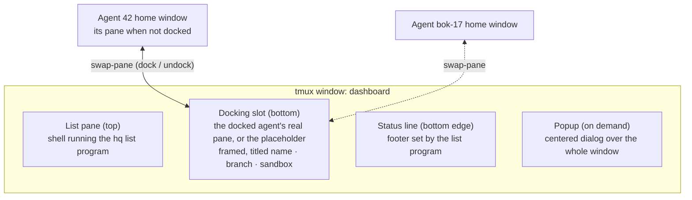
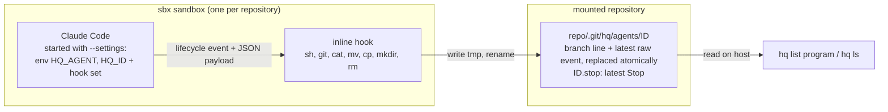
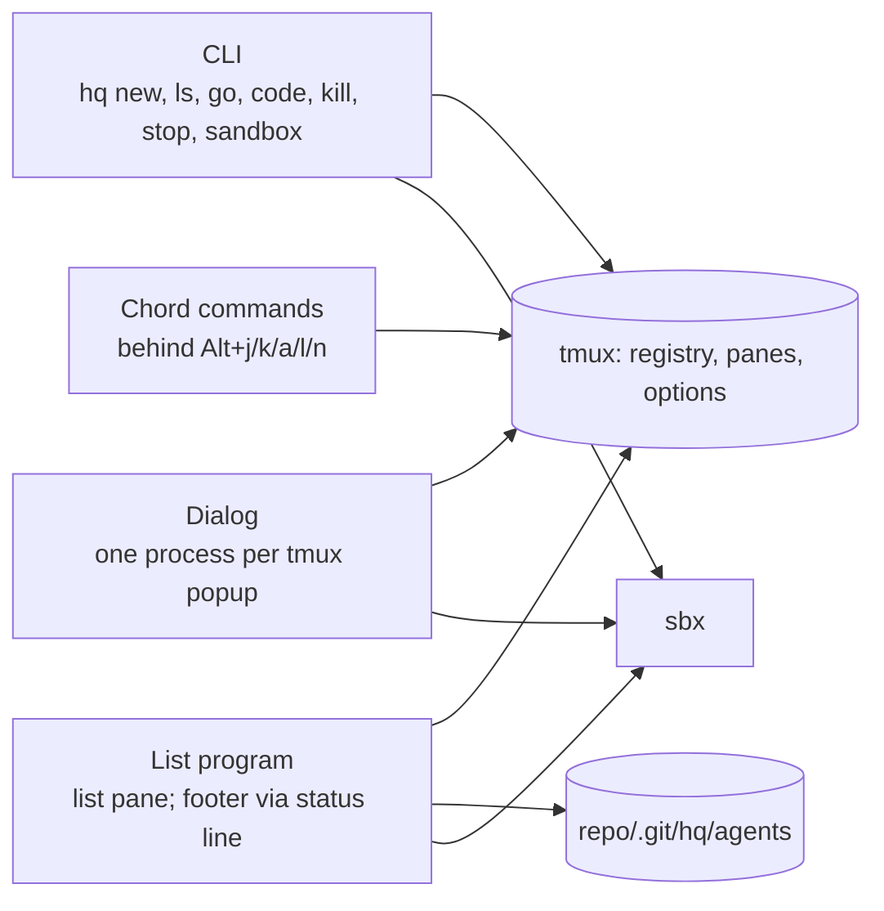
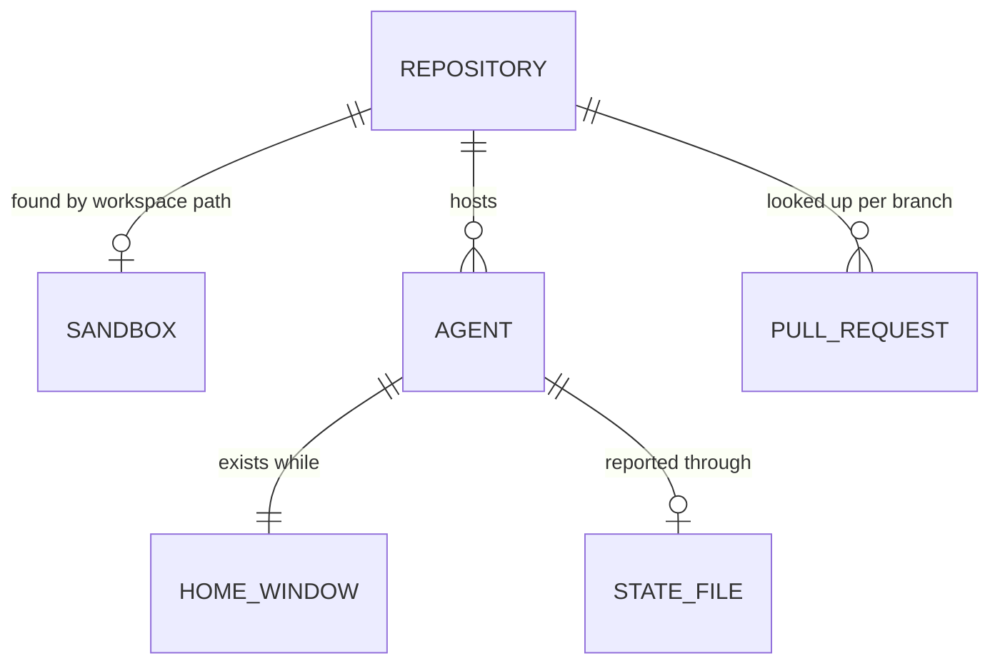

# hq - design

Version 1.0 (draft, in progress)

HOW hq is built. The WHAT is `docs/requirements/spec.md`; this document cites it by section (`§5`), scenario (`S4`) and acceptance (`§10`) and never restates it. Decisions that are hard to reverse live in `docs/adr/`.

## 1. Overview & design drivers

The architecturally significant requirements, in priority order. When two pull in different directions, the higher one wins.

1. **The givens** (§2, ADR 0001). State leaves a sandbox only through the mounted repository; sessions are tmux entities. Non-negotiable.
2. **The docked session is the real session** (§6.1, S3). The agent's own tmux pane is shown and used in the dashboard; nothing is mirrored or previewed. This makes the dashboard a composition of tmux panes rather than a single full-screen program that draws everything.
3. **No daemon** (§8, ADR 0002). Every command works with no dashboard running; only the dashboard observes state and notifies.
4. **Identical behaviour on both platforms** (§2, §8, S13): macOS with iTerm2, and WSL with Windows Terminal, both with plain tmux (ADR 0008). Platform-specific code sits behind one adapter.
5. **Timeliness and exactness** (§5, §10): state visible within 1 s, `ended` within 2 s, exactly one notification per attention event.
6. **Install footprint** (§8, §11): one command per platform, no service.
7. **Phase 2 headroom** (spec, Phase 2): a flat row model, sorting and filtering kept separable.

## 2. Constraints & assumptions

Constraints are the spec's givens (§2) and constraints (§8); they are not repeated here. Assumptions below; if one proves false, the decisions that cite it are reopened.

- **A1 - Builders.** hq is built mostly by Claude Code agents working the repository's issues, under the owner's review. Technology is chosen for being agent-friendly and reviewable, not for a team's existing language skills.
- **A2 - Users.** The owner on macOS and a small team (2-6 people) on Windows/WSL. Each person runs their own hq; nothing is shared between machines.
- **A3 - Scale.** Per machine, typically 3-10 concurrent agents, rarely above 15, across 1-5 repositories. At this scale, polling tmux and state files several times a second is negligible, so incremental or event-driven machinery is not justified by load.

## 3. High-level architecture

### 3.1 Dashboard composition

The dashboard is one tmux window built from tmux's own parts ([ADR 0007](../adr/0007-dashboard-is-tmux-composition.md)):



- **List pane.** A shell that runs the list program. The list program owns the list, the cursor, the keys of §6.2-6.5, and the footer text. On `q` it exits and hq takes every client off the `hq` session (3.11), so the terminal gets back what it had before `hq`; the shell stays in the list pane with a hint, seen only by a terminal attached without hq, and `hq` or `hq dash` starts the list there again.
- **Docking slot.** Holds exactly one pane: the docked agent's own pane, or the placeholder with the hint of S1/S6. Docking swaps the agent's pane in from its home window; the pane it replaces goes back to its own home. The agent's process, scrollback and cursor are never interrupted.
- **Placeholder.** Not a shell: a hidden hq command that shows the hint, hides the cursor and takes no commands. Anything it is given (keys, a paste, a click, since it asks tmux for the mouse) is swallowed and puts the keys back on the list pane, so the list's keys keep working. Its pane is marked as hq's placeholder and kept when its program ends, so the home window it waits in never closes with its agent; `hq` starts it afresh when it is not running hq's program, which also replaces the shell an older hq left there, wherever it waits.
- **Frame and title.** tmux pane borders, the title set per pane: `name · branch · sandbox`, or `placeholder`.
- **Footer.** tmux's status line, content set by the list program (key hints; the `/name` search while typing, §6.3). Cleared when the list program exits.
- **Dialogs.** tmux popups centered over the whole window, each running an hq dialog (§6.6). The list keeps refreshing underneath; the popup holds all keys and clicks while open.
- **Layout.** The list pane's height is re-applied on every resize: header + 6 rows + footer, 3 rows in a terminal below 24 rows (§6.1, S12); the slot takes the rest. The terminal's height is tmux's window height plus the session's status lines, which tmux takes from the terminal, so the classic 80x24 terminal (a 23-line window) shows 6 rows.
- **Agent home windows.** Every agent has a home window in the same tmux session, holding its pane while it is not docked. They are invisible to the user: the footer replaces tmux's window list, and the terminal shows only the dashboard window.
- **Finding the parts.** Like the home windows (3.3), the dashboard window and its panes are found by tmux options hq sets on them: the window is marked as the dashboard, each pane carries its role (list or slot), and the list program records its process on the list pane while it runs, so `hq` knows whether to start it again. The session's look (frame, titles, a status line that is only the footer) is set on the `hq` session and the dashboard window alone, never on the tmux server's global options, and reapplied on every `hq`.

Satisfies: §6.1, §6.4 (drawn by the list program), §6.6, S1, S3, S6, S8, S12; driver 2.

### 3.2 Platforms

Plain tmux on both platforms ([ADR 0008](../adr/0008-plain-tmux-on-both-platforms.md)). On macOS the dashboard is an ordinary `tmux attach` inside an iTerm2 window; on WSL, the same inside Windows Terminal. The terminal only hosts tmux; everything hq shows is drawn by tmux and the list program, so both platforms share one code path for the dashboard.

**Decision:** tmux 3.4 or newer on both platforms. Notifications come mostly from agents that are not docked, whose panes sit in hidden home windows, and tmux passes their sequences to the terminal only with `allow-passthrough all` (3.4; 3.3 passes only from the visible pane, 3.2a not at all). hq checks the version at install and at start and exits 3 with the remedy (`hq: tmux 3.2a is too old, 3.4 or newer needed (Ubuntu 24.04 ships it)`). WSL baseline: Ubuntu 24.04; macOS gets a current tmux from Homebrew.
**Alternatives considered:** a fallback for older tmux (a bell from the hidden window): a second code path with weaker behaviour, no text, against spec §5 (kind and branch named).

Satisfies: §2, §5 (notifications from hidden panes), §8 (identical behaviour), §11 (prerequisites), S13; driver 4.

### 3.3 Agent registry

**Decision:** tmux is the registry. An agent exists exactly while its home window exists in the `hq` session; what hq knows at launch (name, repository path, sandbox, start time, the `new` marker) is stored on that window as tmux user options, and an `ending` marker while `hq sandbox restart` takes the agent down (sbx lists a stopping sandbox as running for the seconds the stop takes, S9). Every command and the list program read agents from tmux; there is no registry file.
**Rationale:** with no daemon (ADR 0002), the only always-current record of what runs is tmux itself; a separate file would duplicate it and go stale when a window dies outside hq.
**Consequences:** an agent that ended keeps its window, its dead pane kept readable, until it is killed (S7); removing the window frees the name (§4.2). Removing a window ends only the host side of `sbx run`, and Claude keeps running inside the sandbox, so killing an agent first ends its Claude session there (SIGTERM through `sbx exec`, found by the agent id it was launched with), waits a few seconds for it to exit, then removes the window (S6, S10). The docked agent is known from where the panes are: its own pane, marked with its id, sits in the slot, and the placeholder waits in its home window; the list's other session state (the cursor) is a session option. Both survive `q` and detach as long as tmux runs (S1, S8, S9). An agent's pane carries what must travel with it when docked (its id, staying readable after it ends, passthrough). Staying readable takes two pane options: the dead pane is kept, and the pane has no alternate screen, because Claude draws in the alternate screen and tmux throws that screen away when Claude leaves it, taking the session with it, and removing a docked agent's window first sends its pane home, so the slot gets the placeholder back (S6). Sort and view must survive a tmux restart (§6.2), so they live in a small per-user preferences file. Agent state does not live here; it comes from the hooks (section 3.4).
**Alternatives considered:** a registry file in the user's home (duplicates tmux, goes stale).
**Satisfies:** §4.1 (`ls`, `go`, `kill`, `stop`), §4.2 (name uniqueness and reuse), §6.2 (remembered sort and view), S1, S7, S8, S9; drivers 1, 3.

### 3.4 State channel

Hooks are injected when hq starts Claude and write the agent's state into the repository's `.git` ([ADR 0009](../adr/0009-hooks-injected-at-launch.md)); no repository setup.



- **Identity.** A fresh id per agent, generated at `hq new`, stored on the home window (3.3) and passed to Claude as `HQ_ID`. Stable across `/clear`; never confused with an earlier agent that reused the name.
- **Events used.** Prompt submitted -> `working`; Stop -> `question` or `done`; Notification of kind permission prompt, agent needs input or elicitation dialog -> `needs input`; session end -> `ended` (also detected from tmux and sbx, section 5). Until the first event an agent is `starting`. Claude in an sbx sandbox runs with permissions bypassed, so tool calls raise no permission prompt; a question dialog (AskUserQuestion) still fires the permission-prompt Notification, which is what `needs input` sees in practice.
- **Branch.** Hooks run in Claude's current directory, which moves into the worktree Claude creates (`CLAUDE_PROJECT_DIR` stays at the repository). The hook asks git there for the checked-out branch and writes it as a header line (`branch NAME`) before the payload: git answers inside the sandbox, where the path is valid on both platforms, so the host never maps sandbox paths to find a branch. Empty before the first event and on a detached HEAD. The payload's `cwd` is kept as the worktree path (for `hq code`, M4).
- **Interpretation on the host.** The hook stores the raw payload after the branch line; hq derives the state, the time it was entered, the one-line last message and takes the branch. `question` vs `done`: the last assistant message ends with `?`, the rule proven by `notify.sh` in support-chatbot.
- **Last message.** `last_assistant_message` of Stop; while `needs input`, the Notification's own message ("Claude needs your permission"). The hook also keeps the latest Stop payload as `ID.stop`, so a `working` or `ended` agent still shows its previous reply. An agent whose pane died is `ended` with `AGE` counted from its last report, not from its start.
- **Location.** The main repository's `.git/hq/`, found from any of Claude's worktrees through git's common directory. Never tracked, no ignore rule.
- **Lifetime.** An agent's files live as long as the agent: when hq removes it (`hq kill`, `hq stop`, the Kill dialog, `k` on an ended row), it deletes that agent's `ID` and `ID.stop` after its window, when its session has ended and nothing reads them any more. Only the removed agent's files go, by id: agents of other tmux servers (another worktree's `scripts/local-dev.sh`, a tester) report to the same directory, and hq cannot tell whether an unknown id is gone or lives elsewhere, so it never prunes other files. A session that outlives the kill's wait may write its file once more; that file stays.

Satisfies: §5 (states, age, last message, no setup), §8 (no repository files), S2, S4, S5, S11; drivers 1, 3.

### 3.5 Notifications

The agent's injected hook sends the notification ([ADR 0010](../adr/0010-hooks-send-notifications.md)): on Stop it returns `Question: <branch>` or `Done: <branch>` (the `?` rule in `awk`), on the Notification event `Needs input: <branch>`, as a `terminalSequence` that Claude writes to its pane and tmux passes to the terminal. hq bakes the platform's notification sequence into the hook at launch (3.10), and every agent window gets `allow-passthrough all` when it is made (3.2; it is a pane option, so it is set per window rather than on the session). tmux drops a bare OSC 9, and Claude accepts from a hook only OSC and BEL, not tmux's passthrough wrapper; Claude wraps the sequence itself when `TMUX` is set, which sbx does not pass into the sandbox, so the injected settings set it (verified with Claude 2.1.283). The branch is the one the hook reads for the state file, or the directory's name when HEAD is detached; it loses control characters, `\` and `"` so it cannot break the JSON or add a sequence of its own, and neither it nor the message is ever used as a format. Only Stop and the attention Notifications carry the sequence; the prompt and session-end hooks print nothing. No hq process takes part, so exactly-once holds by construction. tmux passes the sequence only to a terminal attached to the `hq` session, and `q` detaches it (3.11), so after `q` notifications stop until `hq` (ADR 0007, 0010).

Satisfies: §5 (exactly one notification per attention or done event, docked or not, kind and branch), §10, S4, S5; drivers 3, 5.

### 3.6 Sandboxes

**Decision:** hq resolves DIR to the main repository root (through git, so a subdirectory or one of Claude's worktrees is the same repository) and finds that repository's sandbox by workspace path in `sbx ls --json`, not by name. With none, the first `hq new` creates it under sbx's default name; the one-time Claude login happens in the docked session (S2). An agent's home window runs `sbx run --name <sandbox> -- --settings '<env + hooks>' [prompt]`.
**Rationale:** lookup by workspace path cannot collide on two repositories with the same folder name and adopts sandboxes the user created by hand.
**Satisfies:** §2 (one sandbox per repository), §4.1 (`hq new`, `hq sandbox`), S2, S11.

- **`hq sandbox restart REPO`** (S9): after confirmation (`-y` skips it, no terminal refuses, as `hq kill`), stop and start the sandbox, then relaunch each of the repository's agents in its own pane (`respawn-pane`), same window, same name, same id, with `--resume <last Claude session id>` taken from the agent's last state file, so each conversation continues. The window is never removed, so the row stays through the restart (`ended` from the `ending` marker, then `starting`), the name stays taken, and a docked agent, whose pane is in the slot, stays docked with its frame. The window's start time moves to the relaunch; the state file, kept, is the previous session's until the new one reports: a report older than the start gives the branch, worktree and last message, not the state (5.1), so the row reads `starting` with what it last said. Start times are kept to the millisecond so a relaunch in the same second as the last report is told apart. After `sbx stop` hq waits for the agents' panes to die (at most the kill's wait), so no hook of the old session writes after the relaunch. sbx has no start command: running anything in a stopped sandbox (`sbx exec`) starts it, which also restarts a sandbox without agents. The session id is read before the stop and passed only when it has the form of a Claude session id, since the sandbox writes the state file; an agent that never reported starts fresh. An agent killed while the sandbox restarts is not relaunched.
- **`hq sandbox rm REPO`**: refused while agents of the repository run (§4.1), then hq asks and runs `sbx rm --force` (sbx would otherwise ask a second time). REPO is a directory in the repository or its name as `hq ls` shows it, matched against the base name of each sandbox's workspace.

### 3.7 Keys and mouse

**Decision:** prefix-free Alt+letter chords, bound in tmux for the `hq` session only, work anywhere in the dashboard, including while typing to Claude in the docked session:

| Chord | Action | Mirrors in the list |
|---|---|---|
| `Alt+j` / `Alt+k` | dock next / previous row | `j` / `k` |
| `Alt+a` | dock the first agent needing attention, skipping the one docked now | view `a` |
| `Alt+l` | toggle focus between list and session | - |
| `Alt+n` | New agent dialog | `n` |

Docking by chord moves the cursor to the newly docked row. Each chord runs an internal hq command that performs the swap, so it works whatever the list program is doing. Kill stays `k`, `y` (`Enter` means No, ADR 0004).
**Rationale:** walked through the triage, kill, new-agent and name-jump flows: the triage loop is one chord per hop without leaving the keyboard. Alt+Enter (Claude Code's newline), Alt+arrows (word movement in Claude's input; Windows Terminal's pane focus) and Alt+Space (Windows system menu) collide; home-row letters mirroring the list keys do not. Skipping the docked agent in `Alt+a` avoids re-docking an agent whose answer has not yet been reported (up to one refresh tick).
**Alternatives considered:** Alt+arrows and Alt+Enter (collisions above); the tmux prefix (two keystrokes, and tmux's default prefix Ctrl+B is a Claude Code key); function keys (off the home row, need Fn on Mac laptops).
**Satisfies:** §6.3, §6.5 (in-session dock previous/next/first needing attention, focus switching), S3, S4; drivers 2, 4.

- **Option as Alt on macOS.** iTerm2 sends Option as a special character by default; hq's installation adds an iTerm2 dynamic profile with Option as Esc+, and hq switches the dashboard's tab to that profile when it attaches (3.11). No user setup (spec §5, §11).
- **Mouse.** tmux mouse mode on for the `hq` session only. Clicks in the list go to the list program (row: cursor; strip item: action, §6.3, §6.4); clicks in the docked pane focus it and pass to Claude; an open popup takes all clicks (§6.6). Inside `hq` a drag selects through tmux (copy mode); the terminal's own selection stays one modifier away (Option-drag in iTerm2, Shift-drag in Windows Terminal), and other tmux sessions keep the server's setting.

### 3.8 Components of the hq binary

One binary, four roles; they share the row model and never talk to each other directly: tmux and the state files are the only shared state.



- **List program.** Bubble Tea and Lip Gloss: header, rows, action strip, scroll hint (§6.1-6.4), mouse from tmux, colours degrading on terminals with fewer colours. Sets the footer through the `hq` session's status line and clears it on exit.
- **Dialog.** A short-lived hq process in a tmux popup, same library, styled as the mocks (§6.6). It performs its own action (kill, start); the list sees the result on its next tick. It stays open to show an error under a field (duplicate name). `Alt+n` opens the same New agent dialog anywhere. The popup runs a hidden hq command; tmux draws its frame and holds the client's keys, and the list, which opened it, refreshes on while it waits for it to close.
- **Row model.** One model for `hq ls` (plain columns, `--json`) and the list program (§4.1, §6.1).
- **Platform adapter.** Every role reaches `sbx`, the editor, the browser and the notification sequence through it (3.10); nothing else knows the platform.

Satisfies: §4.1, §6.1-6.6, S2, S6; drivers 2, 3.

### 3.9 Distribution and updates

**Decision:** on every `v*` tag the release workflow cross-compiles hq (macOS arm64/amd64, Linux amd64/arm64) and attaches the binaries to the GitHub release, beside the notes written by `scripts/release.sh`. First install is one command through the authenticated `gh` (the repository is private): `gh release download -R rkrysinski/hq -p install.sh -O - | sh`; `install.sh` puts the binary in `~/.local/bin/hq` and, on macOS, the iTerm2 profile of 3.7. `hq update` does the same from inside hq: latest release through `gh`, download, replace itself in one step. The dashboard checks the latest release tag in the background at start, at most once a day, cached in the per-user preferences file, and shows the header hint; `hq --version` shows it too.
**Rationale:** one command on both platforms with no extra tooling beyond the prerequisites (§11); works on the private repository today and unchanged once it is public; no daemon (ADR 0002).
**Alternatives considered:** a Homebrew tap (a private tap needs a token per machine; poor on WSL); `go install` (every machine needs the Go toolchain); a public download URL (the repository is private for now).
**Satisfies:** §4.1 (`hq update`, `--version`), §6.1 (update hint), §8 (one-command install), §11; drivers 3, 6.

- A release holds `hq-<os>-<arch>` for each platform, `install.sh` and `SHA256SUMS`. `hq update` replaces its own executable by writing the new binary next to it and renaming it over it, so hq is never half-written. The per-user preferences file is `$XDG_CONFIG_HOME/hq/preferences.json` (default `~/.config`) on both platforms. A development build (version `dev`) shows no update hint, and `hq update` moves it to the latest release.
- Once the repository is public, the first-install one-liner can become a plain HTTPS download without `gh`; `hq update` keeps working as is.
- The installer and hq check the prerequisites (`tmux` with the minimum version, `sbx`, `gh`, `code`) and fail with exit code 3 and the remedy (§4.2).

### 3.10 Platform adapter

**Decision:** one component is the only code that knows the platform. hq detects it at startup, not at build time: the Linux binary is on WSL when `WSL_DISTRO_NAME` is set or `/proc/sys/kernel/osrelease` names Microsoft. The adapter covers exactly six concerns:

| Concern | macOS | WSL |
|---|---|---|
| sbx command | `sbx` | `sbx.exe` through Windows interop |
| Paths between hq and sbx | unchanged | `wslpath -w` towards sbx, `wslpath -u` back (workspace lookup in 3.6, worktree path for `c`) |
| Editor (`c`, `hq code`) | `code PATH` | `code PATH`; the Remote-WSL shim takes Linux paths |
| Browser (`p`) | `gh pr view --web` | the same, with `BROWSER` set to `wslview` or `explorer.exe` when unset |
| Notification sequence baked into the hook (3.5) | OSC 9 (`ESC ] 9 ; text BEL`) | BEL, shown as a taskbar flash; it carries no text, and a real check is left to Windows (#9) |
| Raise the window titled `hq` (3.11) | `osascript` to iTerm2, selecting the session on the attached client's terminal | `powershell.exe`, activate the window by title |

Everything else (tmux, registry, state files, keys, dialogs) is one code path.
Paths cross at the sbx client's boundary: the workspaces sbx reports come back as hq's paths, and the workspace hq gives goes out as sbx's path, so the rest of hq only ever sees its own paths. One set of contract tests (an sbx command; every path survives the trip to sbx and back) runs against both adapters and the test fake, which gives sbx Windows-like paths so a test shows which paths went through the adapter.
**Rationale:** these are the only points where the platforms really differ; a narrow interface keeps the rest free of platform branches and lets both sides share one set of contract tests with a fake.
**Alternatives considered:** build-time selection (a WSL binary and a plain Linux binary would differ for no reason); platform checks at each call site (scattered, against spec §8).
**Satisfies:** §2, §4.1 (`hq code`), §6.4 (`c`, `p`), §8 (identical behaviour, platform code isolated), S13; driver 4.

### 3.11 Opening and raising the dashboard

**Decision:** hq never opens terminal windows; it uses the terminal it is run in.
- `hq` / `hq dash` outside tmux attaches there with `attach -d`, detaching any other client, so there is one dashboard at a time. Inside the `hq` session it selects the dashboard window; inside another tmux session it switches the client rather than nesting.
- On iTerm2, just before attaching, hq sends iTerm2's `SetProfile=hq` sequence, so that tab alone takes the installed profile with Option as Esc+ (3.7). Windows Terminal needs nothing.
- `q` (S8) takes the terminal off the `hq` session once the list program has ended: a client whose last session is another session of the same server is switched back there and shown the S8 hint on its status line; any other client is detached, so tmux restores the terminal (normal screen, full scroll region, mouse off) and `hq` returns, printing the S8 hint. The list pane is left without a list program, so the next `hq` starts it and attaches to the same layout and docked session.
- While attached, tmux sets the terminal's title to `hq` (`set-titles`, the `hq` session only). `hq go NAME` from another shell docks the agent; if a dashboard client is attached it asks the platform adapter to raise the window titled `hq` (3.10); if none is, it attaches in the current terminal as `hq` does.

**Rationale:** attaching in place avoids driving terminal windows, which differs per terminal; what remains is one narrow action, "raise the window titled hq", with the same shape on both platforms.
**Alternatives considered:** opening a new terminal window per `hq` (iTerm2 AppleScript and `wt.exe` differ in every detail, and the user loses the terminal they chose); several attached dashboards (tmux clients fight over the window size).
**Satisfies:** §4.1 (`hq`, `hq dash`, `hq go`), §4.2 (same from any shell), §6.5 (Alt chords need Option as Esc+), S1, S8, S9; drivers 2, 4.

## 4. Technology choices

| Slot | Choice | Driving requirements | Rationale (one line) | ADR |
|---|---|---|---|---|
| Session host | tmux, plain, both platforms | §2, §6.1, §8 | draws the whole dashboard identically on both platforms | 0007, 0008 |
| Language and runtime | Go, one static binary | §8, §11; drivers 4, 5, 6 | one-command install, instant chords, cross-compiles for macOS and WSL | 0011 |
| Terminal UI | Bubble Tea, Lip Gloss | §6 | the standard Go library for full-screen terminal apps, mouse included | - |
| Distribution | GitHub releases, `gh`-based installer and `hq update` | §8, §11 | one command on both platforms, works while the repo is private | - |
| Pull request lookup | `gh pr list` per repository, cached in memory | §6.4 | no network in the refresh loop; `gh` is a prerequisite already | - |
| Agent registry | tmux windows and their options | §4, §8 | always current without a daemon | - |
| State transport | inline hooks injected with `--settings`, files in `.git/hq/` | §2, §5, §8 | no repository setup, nothing tracked | 0009 |
| Notifications | the hook's `terminalSequence` | §5 | exactly once by construction, no hq process | 0010 |

## 5. Key algorithms & data structures

### 5.1 Refresh loop

Problem: state visible within 1 s (§5), CLI changes within 1 s (§4), an externally stopped sandbox `ended` within 2 s of its having stopped (§10), with no daemon.

**Decision:** polling, no file watching. Every 250 ms the list program makes one tmux query (home windows, their options, pane liveness) and checks the modification time of each agent's state file, reading only the changed ones. Every 1 s it runs `sbx ls` once. `hq ls` runs the same collection once.
**Rationale:** at A3's scale a tick is one tmux call and about 15 file checks; polling gives one code path on both platforms and bounded latency (250 ms for tmux and hooks, 1 s for sbx).
**Alternatives considered:** OS file watching (FSEvents, inotify): platform-specific, and tmux and sbx would still need polling.
**Satisfies:** §4 (dashboard reflects CLI within 1 s), §5 (1 s), §10 (2 s), S4, S7; drivers 3, 5.

```
every 250 ms:
    windows <- tmux: home windows with options, pane dead?
    for each agent: if mtime(state file) changed: parse payload -> state, since, last, branch
    every 4th tick: running <- sbx ls
    agent.state <- ended  if pane dead or session-end event or (reported and sandbox not in running)
    rows <- sort(filter(agents, view), mode)    # filter and sort kept separate (Phase 2)
    redraw list and footer if anything changed
```

`ended` has three sources, first one wins: the pane's process died (Claude exited, launch failed, or `sbx run` returned because its sandbox stopped), the session-end hook, or `sbx ls` no longer listing the sandbox as running. sbx's answer counts only for an agent that has reported: before its first report the session may still be waiting for `sbx run` to start a stopped or just created sandbox, which takes seconds, and the agent is `starting` (S2); should the sandbox stop before then, `sbx run` returns and the pane's death ends it.

### 5.2 Pull request lookup

Problem: the strip shows `p pr` only when the branch has a pull request (§6.4), without the network in the 250 ms tick.

**Decision:** the list program keeps an in-memory map branch -> pull request (number, state, URL) per repository shown, filled in the background by one `gh pr list --state all --json number,headRefName,state,url` per repository; with several pull requests on one branch the newest wins. It refreshes a repository at list start, every 60 s, and at once when one of its agents turns `done`. `p` opens the URL from the map through the platform adapter's browser (3.10); if the map was stale, the footer says `no pull request for BRANCH`. When `gh` is missing, logged out or offline, the strip leaves out `pr` and the list shows no error.
**Rationale:** one call per repository per minute is far below GitHub's limits at A3's scale; refreshing on `done` catches the moment a pull request usually appears (S5).
**Alternatives considered:** `gh pr view BRANCH` per agent per tick (network in the loop, one call per agent); lookup only when `p` is pressed (the strip could not know whether to show `pr`).
**Satisfies:** §6.4 (`pr` shown only with a pull request, `p`), S5; drivers 5, 7 (the same map can feed the Phase 2 pull request status column, spec §9).

## 6. Conceptual data model

No database; each entity lives where its source of truth is.



| Entity | Lives in | Holds | Written by |
|---|---|---|---|
| Agent / home window | tmux window and its user options (3.3) | name, id, repository path, sandbox, start time, `new` marker | `hq new`, `hq kill`, `hq sandbox restart` |
| State file | `repo/.git/hq/agents/ID` and `ID.stop` (3.4) | the branch Claude works on, the latest raw hook payload and the latest Stop payload; state, since (host modification time, 7.1), last message, branch, worktree path and Claude session id are derived from it | the injected hook; deleted with its agent by `hq kill`, `hq stop`; kept across `hq sandbox restart`, which keeps the id |
| Session state | tmux session options and pane positions (3.3) | the cursor; the docked agent, from where its pane is | list program, chord commands |
| Preferences | per-user file (3.3, 3.9) | sort, view, last update check and latest known version | list program |
| Pull request map | list program memory (5.2) | branch -> number, state, URL | list program |
| Row | derived, never stored | one agent joined with its state and pull request; shared by `hq ls` and the list (3.8), so both show the same; an `ended` agent without a last message has `[session ended]` as its last message, in `hq ls --json` too | - |

Satisfies: §4.1 (`ls`, `--json`), §5, §6.1, §6.2; drivers 3, 7.

## 7. Cross-cutting concerns

### 7.1 Failure handling

The CLI follows spec §4.2 (exit codes 0-3, one `hq:` line naming the remedy). Underneath the dashboard and the hooks:

- **Hooks never get in the way.** The injected hook always exits 0 and never blocks Claude. If it cannot write the state file, the agent keeps working and the row keeps its last state; the pane's death still gives `ended`.
- **sbx down is not a missing sandbox.** A failed or timed-out `sbx ls` (no answer within 5 s; it usually answers in under a second) changes no row; sbx contributes `ended` only when `sbx ls` succeeds without listing the sandbox as running (5.1). While sbx is unreachable the header's refresh indicator shows `sbx ?`; `gh` failures only hide `pr` (5.2).
- **A crashed list program leaves the window intact.** Its pane falls back to a shell as after `q` (S8), with one `hq:` line, and the terminal stays attached so the line is seen; the docked session is untouched and `hq` brings the list back. Diagnostics go to a small, size-capped per-user log in the XDG state directory, never into the list.
- **Times are host times.** `AGE` and `since` come from the host's modification time of the state file, not from a timestamp written inside the sandbox, whose clock can lag after the host sleeps; after a sleep `AGE` shows real elapsed time, and `hq ls` agrees with the dashboard.
- **Concurrent `hq new NAME`.** tmux has no atomic create-if-absent, so uniqueness (§4.2) is checked again after the home window is created; of two windows with one name, the later removes itself and exits `1`. No lock file.

**Satisfies:** §4.2 (exit codes, errors, name uniqueness), §5 (states truthful), §10 (externally stopped sandbox `ended` within 2 s, without false `ended`), S7, S8, S9; drivers 3, 5.

### 7.2 Testability

**Decision:** six seams, each an interface with an in-memory fake: tmux, sbx, gh, the platform adapter (3.10), the clock and the state-file reader; nothing else touches a process or a file. The pyramid of `docs/agents/testing.md` maps to Go as:

| Level | Selected by | Covers |
|---|---|---|
| Unit | plain `go test` | payload to state, attention order, views and sorting, row model and `hq ls` output, pull request map, version comparison, the list's rendering through Bubble Tea's `teatest` with golden output per mock scenario |
| Integration | build tag `integration` | real tmux on a private socket per test (`tmux -L hq-test-N`); the injected hook run by `sh` on recorded Claude hook payloads, `?` rule included; a stub `sbx` on PATH; contract tests shared by fakes and real adapters |
| End-to-end | build tag `e2e` | a few journeys (start, see, dock, kill, sandbox stopped) in real tmux, with the stub `sbx` running a fake `claude` that fires the hooks; driven by `send-keys`, read by `capture-pane`, which also yields the QA screenshots |

CI runs a matrix of `ubuntu-latest` and `macos-latest` (both have tmux) plus the ported pyramid check counting test functions per tag. Real sbx and Claude are left to the manual test (spec §10); the WSL side of the adapter is unit-tested with a fake `wslpath` and verified by hand (S13), as hosted CI has no WSL.
**Rationale:** sbx and Claude cannot run in CI, so a stub `sbx` with a fake `claude` firing real hook payloads is the widest seam that still exercises all of hq's own code; a private tmux socket keeps tmux tests real without touching the user's server.
**Alternatives considered:** mocking tmux in integration tests (tests the fake, not the composition of ADR 0007); CI with real sbx (needs microVM support and a Claude login on the runner).
**Satisfies:** §10 (acceptance, manual test), S13; `docs/agents/testing.md`; drivers 1, 4.

### 7.3 Security

The one boundary hq opens is files written inside the sandbox and read and shown on the host. The threat is Claude, or content it read from a repository or the web, pushing something harmful across it. A spoofed state is harmless: the user's own agent misreporting itself.

- **Output is stripped.** `last_assistant_message` and every other field from a state file lose control characters and escape sequences before they reach the list or `hq ls`, so a message cannot retitle the terminal, redraw the screen or fake a notification.
- **State files are data only.** hq reads only `agents/ID` for ids it issued; it checks with `lstat` and opens without following links, rejecting anything but a regular file, so a symlink planted in the repository cannot make the host read `~/.ssh/...` and show it in `LAST`; it caps the size at 64 KiB and parses defensively.
- **No shell in between.** hq starts processes as argument lists, tmux's `new-window` in its multi-argument form that executes directly; names are restricted by §4.2; prompts and paths are always one argument, never pasted into a command string. The injected hook never uses the branch or the message as a `printf` format or in `eval`.
- **Updates are verified.** Every release publishes `SHA256SUMS`; `install.sh` and `hq update` check the downloaded binary against it before replacing anything (3.9).
- **Nothing new crosses the sandbox boundary.** The hook writes only into `.git/hq/` of the already mounted repository; hq passes nothing into the sandbox beyond what `sbx run` receives at launch.

**Satisfies:** §2 (sandboxes as isolation), §5 (last message shown), §8; drivers 1, 6.

## 8. Risks & open questions

- **Repositories on the WSL file system (open, needs testing).** Whether `sbx.exe` can mount a repository that lives in the WSL file system (`\\wsl.localhost\...`) at usable speed for Claude's work. Unknown until the team runs hq on WSL. Rule fixed in advance:
  - it works: nothing changes;
  - it does not: spec §11 states that on Windows repositories live on the Windows file system (`/mnt/<drive>/...`); `hq new` refuses a DIR outside it with exit 3 and the remedy; the platform adapter (3.10) opens the editor with Windows VS Code on the Windows path instead of the Remote-WSL shim.

## 9. Deferred implementation notes

- Verify on Windows that tmux passes BEL from a hidden window and that Windows Terminal flashes the taskbar (#9).
- Verify the chords of 3.7 against Claude Code's default key bindings and Windows Terminal's default actions; clicks outside an open tmux popup do nothing (verified on macOS with #48; on Windows with the WSL checks).
- Verify in a real iTerm2 that `SetProfile=hq` on attach gives that tab Option as Esc+ and leaves the other tabs alone (#46).
- Verify that Windows lets a background `powershell.exe` activate the window titled `hq` (the foreground lock can refuse).
- `hq update` replaces the binary while a list program may be running; the running list keeps the old version until it is restarted; say so in the update output.

## 10. Version changes

- 1.0 (draft): design drivers agreed.
- 1.0 (draft): assumptions A1-A3 (builders, users, scale).
- 1.0 (draft): dashboard composition (3.1, ADR 0007).
- 1.0 (draft): plain tmux on both platforms (3.2, ADR 0008); risks section opened.
- 1.0 (draft): tmux as the agent registry (3.3).
- 1.0 (draft): state channel with hooks injected at launch (3.4, ADR 0009); spec change: `hq init` and `unknown` removed.
- 1.0 (draft): notifications sent by the injected hook (3.5, ADR 0010).
- 1.0 (draft): refresh loop by polling (5.1).
- 1.0 (draft): sandbox lookup, creation and restart (3.6).
- 1.0 (draft): keys and mouse, Alt+letter chords (3.7).
- 1.0 (draft): Go as language and runtime; technology table (4, ADR 0011).
- 1.0 (draft): components of the binary, dialogs as popup processes (3.8).
- 1.0 (draft): distribution and `hq update` (3.9); spec change: `hq update` and the update hint added; tmux version risk.
- 1.0 (draft): platform adapter (3.10); risk on repositories in the WSL file system.
- 1.0 (draft): pull request lookup (5.2).
- 1.0 (draft): failure handling (7.1).
- 1.0 (draft): testability (7.2).
- 1.0 (draft): conceptual data model (6); driver 4 aligned with ADR 0008; open question on bringing the dashboard to the front.
- 1.0 (draft): spec §2 aligned with ADR 0008 (plain tmux in iTerm2); risk closed.
- 1.0 (draft): tmux 3.4 minimum, WSL on Ubuntu 24.04 (3.2); spec §10, §11 updated; risk closed.
- 1.0 (draft): decision rule for repositories on the WSL file system (8), pending the team's test.
- 1.0 (draft): opening and raising the dashboard (3.11), sixth platform concern; open question closed.
- 1.0 (draft): security (7.3); open question closed.
- 1.0 (draft): state channel built (#19): `starting` before the first event, `ID.stop` for the last message, Notification message while `needs input`; verified with Claude 2.1 in sbx: `env` from `--settings` reaches hooks, the image has `sh`, `git`, `cat`, `mv`, `cp`, `mkdir`, `rm`, the host modification time follows the host clock.
- 1.0 (draft): the branch comes from the hook, which runs in Claude's current directory (verified with Claude 2.1 in sbx), as a header line before the payload (3.4, #20).
- 1.0 (draft): `sbx ls` as the third source of `ended` in `hq ls`, bounded by a 5 s timeout, through the collection shared with the list program; the `ending` marker (3.3, 5.1, 7.1, #21).
- 1.0 (draft): notifications built (#22): the hook's `terminalSequence` on Stop and the attention Notifications, the branch or the directory name, OSC 9 on macOS and BEL on WSL, `allow-passthrough all` per window, `TMUX` set for Claude so it wraps the sequence for tmux; verified with Claude 2.1 in sbx that the sequence from a hidden window reaches the terminal exactly once per event.
- 1.0 (draft): `hq sandbox restart` resumes each conversation with `--resume` (3.6, #23); verified with Claude 2.1 in sbx that `--resume` passes through `sbx run`, that a second `sbx run --name` starts its own session, and (#19) that hooks from `--settings` run alongside a repository's own.
- 1.0 (draft): dashboard window and list program built (3.1, 3.8, 3.11, 5.1, #31): parts found by tmux options, `hq` in the list pane runs the list there, the status line replaced by the footer for the `hq` session only.
- 1.0 (draft): sorts, views and the cursor built (3.3, 6.2, 6.3 keys, #32): sort and view kept in the preferences file, the cursor's agent in a session option, so both survive `q`; the cursor follows its agent across refreshes and mode changes, and returns to it when it shows again.
- 1.0 (draft): docking built (3.1, 3.3, 3.11, #33): the docked agent is known from where its pane is rather than a session option; each agent's pane carries its id, `remain-on-exit` and passthrough so they travel with it; `hq go` docks before attaching; the docked row's outline is drawn as bars at both ends so it takes no extra lines.
- 1.0 (draft): New agent dialog built (3.3, 3.8, #34): the dialog shares `hq new`'s start, its errors tagged with the field they belong under; the `new` marker is set by `hq new` only (not by a relaunch) and read as new while the agent has not reported and is not ended, so nothing clears it; the list welcomes an agent the first time it sees it new (cursor, and the slot when nothing is docked), since its sandbox may be missing from the list's last `sbx ls` answer for a moment.
- 1.0 (draft): Kill dialog built (3.3, 3.8, #35): the yes/no dialog runs `hq kill`'s ending of the agent itself, so killing the docked agent leaves the placeholder with its hint and the keys on the list as `hq kill` does; the question names the branch, the repository while the branch is not known. `k` is kill in the list (spec §6.4), so the cursor moves with `↑`/`↓` and `j`; spec §6.3's `j/k` predates the row actions.
- 1.0 (draft): `hq code` and `c` built (3.10, #51): the editor is the platform adapter's editor concern (`code DIR` on both platforms); the directory is the top of the work tree Claude reports as its current directory, brought back from the sandbox's path, so a subdirectory opens its worktree; the repository while nothing is reported, or when that directory is gone or outside the agent's repository.
- 1.0 (draft): `/name` search built (6.3, S3b, #44): the search matches the rows the list shows (the current view), so a hidden agent is reached with `a` first; while it runs every letter is the search's, not a key; the footer names the matches as the mock does (`/bo 1 match: bok-17`), and its hints are two spaces apart so they fit 120 columns with `/name` in them.
- 1.0 (draft): Alt chords built (3.3, 3.7, 3.8, #45): tmux key tables are per server, so each chord is bound in the root table behind a check that the client is in the `hq` session, handing the key on elsewhere to its earlier binding or the pane; the bindings run the command kept in a session option, so they are bound once and follow hq when it moves. `Alt+j`/`Alt+k` stop at the ends of the list; while the docked agent is not shown (the attention view), they go from the cursor, which stands where it left. `Alt+l` is tmux's own pane switching. The list's cursor follows any change of the docked agent (a chord, `hq go`), and the footer shows the chords while the keys are in the slot. A chord runs in the background, so its errors go to the status line.
- 1.0 (draft): action strip and pull request lookup built (3.10, 5.2, #43): the strip is drawn over the tail of the cursor row as chips, key in the accent; the platform adapter's browser is `gh pr view --web URL`, on WSL with `BROWSER=explorer.exe` when `BROWSER` is unset (every WSL has it; `wslview` needs wslu); gh runs in the repository's directory with a 30 s limit, and a failed answer empties that repository's map, so `pr` goes away rather than pointing at a stale pull request. With `p pr` the footer needs 124 columns; when the window is narrower, `⏎ open session below` becomes `⏎ open`, so `q quit` stays in sight at 120.
- 1.0 (draft): Option as Alt built (3.7, 3.9, 3.11, #46): the hq binary holds the iTerm2 profile, and `install.sh` (through a hidden command) and `hq update` both write it, so the two never differ. It is written only on macOS with iTerm2 present (the app in `/Applications` or `~/Applications`, or iTerm2's support directory), rewritten only when it changed, and moved into place so iTerm2 never loads half a file. The profile has no parent, so it inherits the user's default profile and changes only the Option keys; no other profile is touched, and removing `hq.json` removes it. `SetProfile=hq` is sent only when the terminal says it is iTerm2: `TERM_PROGRAM`, and `LC_TERMINAL` only when `TERM_PROGRAM` is unset (through ssh), because programs started from iTerm2, such as VS Code, pass `LC_TERMINAL=iTerm2` on to their own terminals. The tab keeps the profile after detaching, since iTerm2 does not tell hq which profile it had. A failure to write the profile is a warning: without it only the chords are lost.
- 1.0 (draft): narrow layout built (6.1, 6.4, S12, #49): from 100 columns the rows show `LAST`, at least 32 cells so the strip with labels covers it alone; below, `LAST` goes and the strip is glyphs (`⏎ c p ✕`), and below 80 `REPO` goes too. Columns too wide give way in order branch, repository, name, each cut with `…`; the last column takes the rest of the line, so rows, the docked outline and the strip reach the right edge. The header gives up the update hint, the view, then the counts from the last, keeping the clock; the footer takes the first set that fits: all hints, then `⏎ open`, then the mock's narrow set (`⏎ open  c code  p pr  k kill  n new  / name  q quit`), dropping hints before `q quit` below that. Every line is cut to the width, so nothing wraps.
- 1.0 (draft): mouse built (3.7, 3.8, #48): the `hq` session has tmux's `mouse` option on, so tmux's own bindings focus the pane clicked and hand the click on; the list program and the dialogs take the mouse and act on a left press only. A click on a row moves the cursor; on the cursor row it fires the strip item under it, as its key does, and does nothing between items; the wheel moves the cursor as the arrows do. While a dialog is open or a name is typed, the list ignores clicks. In a dialog, `×` (give or take a cell), the buttons and, in the New agent dialog, a field's whole box with its label take clicks; a click while an agent starts or is killed does nothing.
- 1.0 (draft): raising the dashboard built (3.10, 3.11, #47): `hq go NAME` from a plain terminal docks the agent and, when a client is attached to the `hq` session, shows it the dashboard window and asks the adapter to raise that client's window, printing `docked NAME in the open dashboard`; with none it attaches in place. On macOS the adapter finds iTerm2's session by the client's terminal (`tty`), exact where the title can carry iTerm2's decorations, and never starts iTerm2; on WSL it activates the window titled `hq`, the client's terminal meaning nothing to Windows. A failed raise leaves the agent docked and says so in one line, exit 0. tmux leaves the title `hq` on the terminal when it detaches, so hq clears the title when its attach ends, leaving no second window titled `hq` to raise.
- 1.0 (draft): ended agents stay readable (3.3, S7, #38): Claude Code draws in the terminal's alternate screen, and when it exits tmux returns to the normal screen, which never held the session, so every ended agent showed only its resume line. Agent panes now have `alternate-screen` off: Claude draws on the normal screen and renders as before; after `/exit` its last screen stays, and when its sandbox stops, the clear Claude sends pushes the session into the pane's history (`scroll-on-clear`), one scroll up. The cost: Claude redraws its whole screen when its pane is resized, as on every dock and undock, and each old frame goes to the history too, so scrolling up shows repeated frames (tmux's `history-limit` bounds them); keeping them out (`scroll-on-clear` off) would lose the session when the sandbox stops. A Claude that also cleared the history on exit would undo this; the real check is part of the M4 acceptance (#50). Agents started before this keep their pane's setting until they are docked or restarted.
- 1.0 (draft): list movement settled (spec §6.3, #63): the spec now moves the cursor with `↑`/`↓` only and `k` stays kill, so the lone `j` is gone from the list. The dock chords keep `Alt+j`/`Alt+k` (3.7): they are home-row keys that collide with nothing, which holds without the list keys they once mirrored.
- 1.0 (draft): the docked agent shown in the attention view (spec §6.2, S0, ADR 0006, #65): the view's filter keeps an agent that needs the user, is new, or is docked, so a working agent docked below no longer leaves the list reading "nothing needs you"; the empty state shows only when no row qualifies. Filter and sort stay separate steps (5.1). Since every view now shows the docked agent, `Alt+j`/`Alt+k` go from the docked row in the attention view too; going from the cursor (#45) remains for when nothing is docked.
- 1.0 (draft): names settled (spec §3, §4.1, §4.2, #68): a name has at most 32 characters, and a name over the limit gets its own error naming the limit (`hq: name '...' is too long: at most 32 characters`), in `hq new` and under the New agent dialog's name field; a bad character still gets the characters message, checked first. `hq help` states the rule. The spec now says what hq always did: a name is taken while its agent exists, `ended` included, until it is killed.
- 1.0 (draft): state files removed with their agent (3.4, 6, #69): removing an agent's window (kill, stop, the Kill dialog, `k` on an ended row, the old ids at sandbox restart) also deletes its `ID` and `ID.stop`, so the directory no longer grows by two files per agent. Pruning files of agents hq does not see at `hq new` was left out: other tmux servers' agents report to the same directory, and any age limit would still risk an agent that has been quiet for a long time.
- 1.0 (draft): the placeholder is not a shell (3.1, spec §6.1, #66): the empty slot showed a shell prompt that looked like part of hq and ran whatever was typed. It is now a hidden hq command that shows the hint and swallows keys, pastes and clicks, each putting the keys back on the list; its frame is titled `placeholder`. It needs the hq binary, so the tmux adapter is given hq's placeholder command. An older hq's placeholder shell is replaced by the next `hq`, and a placeholder whose program ended is started again, its pane kept so a home window never closes with it.
- 1.0 (draft): `q` gives the terminal back (3.1, 3.5, 3.11, ADR 0007, 0010, spec S8, §5, §6.5, #67): the list pane used to fall back to a shell of three lines over the docked pane, which read as a broken terminal. Now hq takes every client off its session at `q`: a plain terminal is detached to the shell it had, a client that switched in from another session of the server goes back there; the list pane is unmarked first, so an `hq` run at once starts the list again. After `hq` returns, the terminal gets the title reset and the S8 hint, while hq's session still exists. Trade-off: with no terminal attached, tmux passes no notification, so after `q` none are shown until `hq`.
- 1.0 (draft): the row threshold counts the terminal (spec §6.1, S12, #79): the list pane's height followed tmux's window height, one line short of the terminal because of hq's status line, so an 80x24 terminal showed 3 rows. The layout now adds the session's status lines (`#{status}`: off, on or a number) to the window height before applying the 24-row threshold.
- 1.0 (draft): the cursor after a kill (spec §6.3, #82): killing an agent ends its session a moment before its window goes (3.3), and `hq stop` ends one agent after another, so a refresh can see the row `ended` and sorted to the bottom, where the cursor followed it and stayed when the row went. The list now keeps the cursor's place apart from its row: the cursor still follows its agent, but a row the list saw not ended within the last 10 s keeps its earlier place, and `k` takes the cursor row as the place. When the row goes, the cursor takes the row that took its place, the next one, or the previous one when it was the last.
- 1.0 (draft): one LAST for an ended agent (6, spec S7, §10, #86): an agent that ended before it reported a message showed `-` in `hq ls` but `[session ended]` in the list; the placeholder now lives in the row model (`agent.Collect`), so `hq ls`, `hq ls --json` and the list all say `[session ended]`, as the mocks do. The spec's 2 s for a sandbox stopped from outside now counts from the sandbox having stopped: `sbx stop` takes 7-8 s, during which `sbx ls` still lists the sandbox running and its sessions live on; hq flips the rows about 0.1 s after they end.
- 1.0 (draft): sandbox restart relaunches in place (3.3, 3.4, 3.6, spec §4.1, S9, #85): the restart removed the agents' windows before starting the sandbox again and made new ones, so for the seconds `sbx exec` took the rows were gone and the names free, a docked agent came back undocked with the slot saying it was killed, and the new id lost the branch and last message. Now each agent's own pane is respawned in place under the same id, so the row, the name and the docking stay, and the kept state file gives the branch and last message until the new session reports (a report older than the start does not set the state). This reverses #69's deletion of the old ids' files at restart: there are no old ids any more. Start times are stored with milliseconds (older whole-second values still read). `hq sandbox restart` now asks for confirmation like `hq kill`; `-y` skips it. Respawning keeps the pane's options (kept output, no alternate screen, passthrough, its id) and `--resume` shows the conversation again; what the old session left on the pane's screen may be cleared by the respawn. An agent that had no last message shows `[session ended]` (#86) while its row is ended, and `-` once it is starting again.
- 1.0 (draft): no false `ended` for a starting agent (5.1, spec S2, #94): `sbx ls` lists a sandbox as not running until `sbx run` has started it, so an agent started into a stopped or just created sandbox showed `ended` for those seconds, then `starting`; the list's welcome of new agents already worked around it. sbx now ends only an agent that has reported; before that, its pane's death does. Found as a flaky test on CI.
